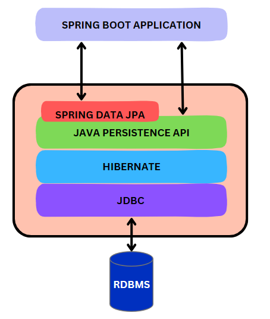
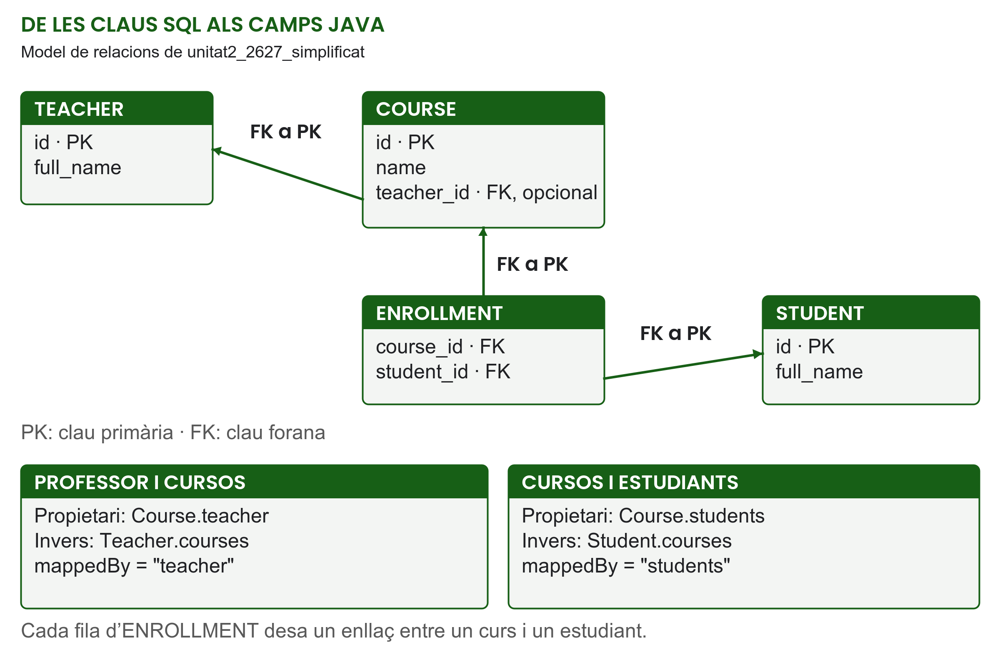

# UT2 — Accés a dades amb Spring

**CIFP Pau Casesnoves · IFC33C · Curs 2026–2027**  
**Mòdul:** 0613. Desenvolupament web en entorn servidor  
**Professor:** David Pons

## Presentació

En aquesta unitat introduirem **JPA i Spring Data JPA** per treballar amb dades d'una base de dades relacional des de la nostra aplicació Java. Començarem per entendre el problema que resol el mapatge entre objectes i taules, i després incorporarem les dependències necessàries al projecte Spring Boot.

A la UT1 hem vist com una petició arriba a un controlador i com aquest col·labora amb un servei. Ara afegim una peça nova: la base de dades. Una aplicació pot recuperar informació, modificar-la i conservar-la entre peticions. Per fer-ho, ha d'establir una connexió, representar les dades en objectes Java i decidir quines operacions executa en cada cas.

Seguirem dos fils d'exemple. Amb els **llibres** estudiarem les entitats, les restriccions, els repositoris, les consultes i les operacions de creació, lectura, actualització i eliminació. Amb **professors, cursos i estudiants** estudiarem com es representen les relacions entre taules. Les nocions d'SQL, claus i cardinalitats treballades amb MySQL a primer ens serviran per entendre el mapatge JPA. Quan un fragment omet imports, constructors o altres mètodes, cal conservar-los al projecte Java.

Aprendrem a configurar una connexió, definir entitats, recuperar i modificar dades amb repositoris i comprovar-ne el comportament amb peticions HTTP. També estudiarem els quatre tipus de relació JPA, encara que alguns es presentin amb exemples addicionals al model de classe.

## Índex

1. JPA i Spring Data JPA: per què ens és útil un ORM?
2. Primera passa: incorporar les dependències de persistència.
3. El recorregut d'una dada: HTTP, servei, repositori i base de dades.
4. Connexió a H2 i inicialització de dades.
5. Entitats JPA: el llibre com a primera taula.
6. `JpaRepository` i les operacions CRUD.
7. Consultes derivades, JPQL, SQL natiu i paginació.
8. Relacions entre entitats.
9. Comprovacions amb fitxers `.http`.
10. Repàs i punts de comprovació.

## 1. JPA i Spring Data JPA: per què ens és útil un ORM?

### 1.1. Què és JPA?

**JPA** és l'estàndard que defineix com gestionar la persistència d'objectes Java en una base de dades relacional. El nom prové de *Java Persistence API*; actualment l'especificació s'anomena **Jakarta Persistence**, tot i que continuam emprant habitualment les sigles JPA. Les anotacions que farem servir pertanyen al paquet `jakarta.persistence`.

En aquest context, **persistir** significa desar les dades dels objectes a la base de dades per poder-les recuperar quan les necessitam, sense dependre de conservar el mateix objecte Java en memòria.

JPA defineix com indicar que una classe representa dades persistents, com identificar-ne els objectes i com descriure la correspondència amb les taules. També estableix operacions per desar, recuperar i eliminar entitats. Per executar aquestes operacions necessitam una implementació de l'especificació; en la nostra aplicació aquesta feina la farà **Hibernate**.

Abans d'estudiar les anotacions, convé entendre per què necessitam aquesta correspondència entre objectes i dades relacionals.

### 1.2. El problema: programam amb objectes i desam dades en taules

En Java representarem un llibre amb un objecte `Book`, que té atributs com `title`, `author`, `isbn` i `publishedDate`. En una base de dades relacional, aquest mateix llibre es representa amb una fila de la taula `BOOK`, formada per columnes.

| A l'aplicació Java | A la base de dades de l'exemple |
|---|---|
| Classe `Book` | Taula `BOOK` |
| Un objecte `Book` | Una fila de `BOOK` |
| Atribut `title` de tipus `String` | Columna `title` de tipus text |
| Atribut `publishedDate` de tipus `LocalDate` | Columna `published_date` de tipus `DATE` |
| Atribut `id` | Clau primària de la fila |

Podríem fer aquesta feina directament amb **JDBC**, l'API de Java per accedir a bases de dades. Per recuperar un llibre hauríem de preparar una consulta SQL, indicar-ne els paràmetres, executar-la, llegir les columnes del resultat i construir l'objecte `Book`. Per desar-lo, hauríem de fer el camí invers: extreure'n els atributs i passar-los a un `INSERT` o un `UPDATE`.

Aquest procediment és vàlid, però una part considerable del codi es repeteix per a cada entitat i cada operació. A més, hem de mantenir manualment la correspondència entre noms, tipus i valors. Si afegim una propietat al model, també hem de revisar el codi que la desa i la recupera.

### 1.3. La solució: mapatge objecte-relacional

Un **ORM** (*Object-Relational Mapping*, mapatge objecte-relacional) permet descriure aquesta correspondència perquè una eina gestioni bona part de la conversió entre objectes i files. En lloc de repetir tota la lectura i escriptura de columnes a cada operació, definim el mapatge de les entitats i treballam amb aquestes entitats des de Java.

En el cas dels llibres, indicarem que `Book` és una entitat, que es correspon amb `BOOK` i que `id` n'és l'identificador. A partir d'aquesta informació, Hibernate podrà generar les operacions SQL necessàries per recuperar o desar llibres, dins el context de persistència i les transaccions corresponents.

Això ens és útil perquè:

- **Reduïm codi repetitiu:** delegam la conversió habitual entre atributs i columnes.
- **Treballam amb el model del problema:** el servei pot coordinar operacions amb llibres, cursos o estudiants com a objectes Java.
- **Definim el mapatge en un lloc identificable:** les entitats descriuen identificadors, columnes i relacions.
- **Facilitam el manteniment:** moltes operacions bàsiques es poden reutilitzar sense escriure una consulta SQL diferent per a cada cas.

L'ORM continua executant SQL i la base de dades continua aplicant les seves restriccions. Hem d'entendre les taules, les claus i les relacions per definir un mapatge correcte. També hem de decidir quines dades necessita cada consulta: recuperar totes les files i filtrar-les després al servei pot ser ineficient. Per això observarem l'SQL generat durant el code along i aprendrem a formular consultes específiques quan calgui.

### 1.4. Com encaixen JPA, Hibernate i Spring Data JPA?

Les peces principals col·laboren, però cadascuna té una funció:

| Peça | Funció |
|---|---|
| **JPA / Jakarta Persistence** | Especifica les regles, anotacions i operacions de persistència. |
| **Hibernate** | Implementa JPA i gestiona el mapatge i l'execució de les operacions SQL. |
| **Spring Data JPA** | Facilita la creació de repositoris basats en JPA i aporta operacions comunes i mecanismes de consulta. |
| **H2** | És el motor de base de dades que executa el SQL i emmagatzema les files de l'exemple. |



*Figura 1. Relació entre les peces de persistència d'una aplicació Spring Boot.*

El diagrama situa **Spring Data JPA** com a suport per als repositoris, **JPA** com a API estàndard i **Hibernate** com a implementació que fa el mapatge. **JDBC** permet executar les operacions SQL mitjançant el driver de la base de dades. El cilindre inferior, **RDBMS** (*Relational Database Management System*), representa el sistema gestor de bases de dades relacionals; en el nostre exemple és **H2**.

Als nostres imports identificarem l'API de persistència com `jakarta.persistence`. Les franges ajuden a distingir responsabilitats: JPA defineix l'estàndard que Hibernate implementa. Les fletxes des de l'aplicació també mostren que es pot emprar l'API JPA directament; nosaltres treballarem amb els repositoris de Spring Data JPA.

Quan parlam de «Spring JPA» en aquest context, ens referim a **Spring Data JPA**. Aquesta biblioteca permet declarar una interfície de repositori per als llibres; Spring en crea una implementació amb operacions com cercar-los o desar-los, recolzant-se en JPA i Hibernate. Més endavant veurem com es declara aquesta interfície amb `JpaRepository`.

Spring Boot facilita la integració i la configuració d'aquestes peces. El nostre codi definirà les entitats, els repositoris i els casos d'ús; les biblioteques resoldran bona part del mecanisme de persistència. Per disposar-ne al projecte, la primera passa és incorporar les dependències.

## 2. Primera passa: incorporar les dependències de persistència

### 2.1. Quines dependències afegim respecte de la UT1?

Una **dependència** és una biblioteca que el projecte necessita per compilar o executar una funcionalitat. En el projecte Maven les declaram al fitxer **`pom.xml`**, dins l'element `<dependencies>`. Maven les descarrega i també resol les biblioteques de les quals depenen.

Per començar a treballar amb persistència afegirem dues dependències: **Spring Data JPA** i **H2 Database**. Si cream el projecte amb Spring Initializr, podem seleccionar-les amb aquests noms. Si partim d'un projecte existent, afegim els blocs següents dins el seu `<dependencies>`, al costat de les dependències que ja té:

```xml
<dependency>
    <groupId>org.springframework.boot</groupId>
    <artifactId>spring-boot-starter-data-jpa</artifactId>
</dependency>

<dependency>
    <groupId>com.h2database</groupId>
    <artifactId>h2</artifactId>
    <scope>runtime</scope>
</dependency>
```

### 2.2. Què aporta `spring-boot-starter-data-jpa`?

Un **starter** de Spring Boot agrupa les dependències habituals per a una funcionalitat. Aquest starter incorpora **Spring Data JPA**, **Hibernate** i el suport de **Spring ORM** per integrar la persistència amb Spring. També aporta, de manera transitiva, l'API de Jakarta Persistence i el suport JDBC necessari.

Una **dependència transitiva** és una biblioteca que Maven incorpora perquè una altra dependència la necessita. Per això, en aquest projecte, no hem d'afegir manualment una dependència independent per a cada peça del conjunt. Amb el starter disposarem de les anotacions de `jakarta.persistence` i de les interfícies de repositori de Spring Data JPA.

El starter aporta les eines de persistència, però encara ens falta el motor de base de dades amb què treballaran.

### 2.3. Què aporta `h2` i què significa `runtime`?

**H2** és una base de dades relacional escrita en Java que pot executar-se dins el mateix procés de l'aplicació. La farem servir en memòria per centrar-nos en les entitats i els repositoris sense haver d'instal·lar i administrar un servidor de base de dades separat.

La dependència `com.h2database:h2` inclou el **motor H2** i el seu **driver JDBC**, que permet establir la connexió amb aquesta base de dades. Hibernate fa servir JDBC per executar-hi les operacions SQL.

`<scope>runtime</scope>` indica que aquesta biblioteca és necessària durant l'execució i les proves, però no s'inclou al classpath de compilació del codi principal. Les nostres classes treballaran amb les API de JPA i Spring Data, sense importar classes pròpies d'H2; el motor i el driver s'utilitzaran quan l'aplicació s'executi.

L'ús d'H2 en memòria és una decisió de configuració de l'exemple: les dades desapareixen quan acaba el procés. JPA també permet treballar amb bases de dades que conserven la informació en disc; el mapatge objecte-relacional i la durada de les dades són qüestions diferents.

### 2.4. Què hem de comprovar després d'editar el POM?

En un projecte que usa el parent de Spring Boot, aquest gestiona les versions de les dependències anteriors. Per això els fragments no inclouen `<version>`: empram les versions coordinades per la versió de Spring Boot del projecte.

Després de desar el `pom.xml`, **recarregam o sincronitzam el projecte Maven a l'IDE** perquè descarregui i reconegui les dependències. Comprovam que apareixen les biblioteques de Spring Data JPA, Hibernate, Jakarta Persistence i H2, i que el POM no presenta errors de resolució.

Les dependències web de la UT1 continuen donant suport als controladors i a les peticions HTTP. Les novetats de persistència són el starter JPA i H2. Afegir-les posa les biblioteques a disposició del projecte; a continuació haurem de configurar la connexió i definir les entitats que s'hi desaran.

**Comprovació:** abans de configurar la base de dades, identificam les dues dependències afegides i explicam què aporta cadascuna. Hem de poder justificar per què necessitam tant les eines de persistència com el motor H2, i distingir una dependència declarada al POM d'una propietat de configuració a `application.properties`.

## 3. El recorregut d'una dada

Si el navegador demana un llibre, el controlador interpreta la petició HTTP, el servei decideix què necessita i el repositori consulta la base de dades. La resposta recorre el camí invers. En aquest exemple, l'aplicació envia dades JSON; no genera una pàgina HTML.

```text
GET /books/1
    -> BookController.getById(1)
    -> BookService.getById(1)
    -> BookRepository.findById(1)
    -> base de dades H2
    -> Book -> resposta HTTP
```

| Peça | Responsabilitat |
|---|---|
| Entitat (`Book`) | Representa una dada que JPA pot desar en una taula. |
| Repositori (`BookRepository`) | Defineix les operacions de persistència i les consultes. |
| Servei (`BookService`) | Coordina el cas d'ús i les decisions de l'aplicació. |
| Controlador (`BookController`) | Rep la petició, delega i prepara la resposta web. |
| Base de dades H2 | Emmagatzema les files mentre l'aplicació està en marxa. |

Aquest recorregut situa les peces que acabam d'introduir: el repositori es recolza en Spring Data JPA i Hibernate per accedir a H2. El servei continua decidint què necessita el cas d'ús i el controlador prepara la resposta HTTP.

## 4. Connexió a H2 i inicialització de dades

### 4.1. Com funcionarà la base de dades del projecte?

**Cada vegada que arrenquem l'aplicació, es crearà l'esquema a H2 i es carregaran les dades de demostració de `data.sql`.** Així tindrem llibres disponibles per començar a practicar consultes sense haver d'introduir-los primer mitjançant peticions HTTP.

La càrrega es fa durant l'arrencada, no cada vegada que arriba una petició web.

Per aconseguir aquest funcionament, situarem dos fitxers a **`src/main/resources/`**:

| Fitxer | Responsabilitat |
|---|---|
| `application.properties` | Configura la connexió, la creació de l'esquema, l'ordre d'inicialització i les eines d'inspecció. |
| `data.sql` | Conté les instruccions SQL que carreguen les dades inicials. |

Les dependències del POM aporten les biblioteques; aquests fitxers determinen com les usam i amb quines dades començam. Hibernate crearà les taules a partir de les entitats Java. Per tant, perquè es pugui carregar `BOOK`, l'entitat `Book` haurà d'estar definida al projecte, encara que n'estudiem les anotacions a l'apartat següent.

### 4.2. La configuració completa

El contingut següent recull totes les propietats de la configuració d'exemple. Les línies que comencen amb `#` són comentaris i no s'executen:

```properties
spring.application.name=unitat2_2627_simplificat

# Connexió a la base de dades H2 en memòria
spring.datasource.url=jdbc:h2:mem:testdb;DB_CLOSE_ON_EXIT=FALSE
spring.datasource.driver-class-name=org.h2.Driver
spring.datasource.username=sa
spring.datasource.password=

# Hibernate: dialecte i creació de l'esquema
spring.jpa.database-platform=org.hibernate.dialect.H2Dialect
spring.jpa.hibernate.ddl-auto=create

# Visualització del SQL generat per Hibernate
spring.jpa.show-sql=true
spring.jpa.properties.hibernate.format_sql=true

# Executar data.sql després de la inicialització de JPA
spring.jpa.defer-datasource-initialization=true
spring.sql.init.encoding=UTF-8

# Preparar les dades relacionades dins el servei transaccional
spring.jpa.open-in-view=false

# Consola web per inspeccionar H2
spring.h2.console.enabled=true
spring.h2.console.path=/h2-console
```

### 4.3. Nom de l'aplicació i connexió

**`spring.application.name`** identifica l'aplicació Spring Boot. Aquest nom és independent del nom de la base de dades, que en l'exemple és `testdb`.

Les propietats **`spring.datasource.*`** configuren la font de connexions amb què l'aplicació accedeix a la base de dades:

| Propietat | Què indica el valor de l'exemple? |
|---|---|
| `spring.datasource.url` | `jdbc:h2:mem:testdb` és una URL JDBC d'H2; `mem` selecciona el mode en memòria i `testdb` és el nom de la base de dades. `DB_CLOSE_ON_EXIT=FALSE` desactiva el tancament automàtic d'H2 en sortir de la JVM perquè el tancament el gestioni Spring. No fa persistents les dades. |
| `spring.datasource.driver-class-name` | `org.h2.Driver` és el driver JDBC que aporta la dependència H2. Spring Boot també pot deduir-lo a partir de la URL; aquí el feim explícit. |
| `spring.datasource.username` | `sa` és l'usuari amb què ens connectam a la base de dades d'exemple. |
| `spring.datasource.password` | El valor és buit: la connexió de demostració no requereix contrasenya. |

H2 també pot emmagatzemar dades en fitxers, però aquí empram **H2 en memòria**. En aturar el procés, les dades d'aquesta instància desapareixen. Els llibres afegits o modificats durant l'execució estaran disponibles per a les peticions següents mentre l'aplicació continuï en marxa; quan la tornem a arrencar, començarem amb les dades inicials del script.

### 4.4. Dialecte i creació de l'esquema

**`spring.jpa.database-platform=org.hibernate.dialect.H2Dialect`** indica a Hibernate quin dialecte SQL ha d'emprar. Un dialecte adapta el SQL a les característiques del gestor de base de dades. Aquí seleccionam el d'H2; Hibernate també pot detectar-lo a partir de la connexió.

**`spring.jpa.hibernate.ddl-auto`** determina què fa Hibernate amb l'**esquema**, és a dir, l'estructura de taules, columnes i restriccions descrita per les entitats.

| Valor | Comportament |
|---|---|
| `none` | No crea, modifica ni valida l'esquema automàticament. Les taules s'han de preparar per un altre mecanisme. |
| `validate` | Comprova que l'esquema existent és compatible amb el mapatge de les entitats. Si no ho és, l'arrencada falla; no crea ni corregeix les taules. |
| `update` | Intenta adaptar l'esquema existent al mapatge, per exemple creant taules o afegint columnes. No recrea totes les taules a cada arrencada. |
| `create` | Elimina les taules del mapatge que ja existeixin i les torna a crear a l'arrencada. Les dades anteriors d'aquestes taules es perden. |
| `create-drop` | Recrea l'esquema a l'arrencada i també l'elimina quan es tanca la gestió de persistència de l'aplicació. |

**En aquest projecte triam `create`** per partir d'un esquema nou a cada arrencada i tornar-lo a omplir amb les dades de demostració. Aquesta propietat crea l'estructura; la càrrega dels llibres la farà Spring Boot amb `data.sql`. Són dues tasques diferents.

Canviar `create` per `update` no faria que H2 en memòria conservàs dades després d'aturar el procés. Tampoc faria que `data.sql` es carregàs una única vegada: la inicialització del script té la seva pròpia configuració. Si empràssim una base persistent amb `update` i repetíssim les mateixes insercions a cada arrencada, podríem provocar errors per duplicats. Per al nostre exemple mantenim la combinació H2 en memòria, `create` i càrrega inicial.

### 4.5. Veure l'SQL que genera Hibernate

Aquestes dues propietats faciliten relacionar una operació Java amb el SQL que executa Hibernate:

| Propietat | Opcions i efecte |
|---|---|
| `spring.jpa.show-sql` | Amb `true`, mostra el SQL generat per Hibernate a la consola; amb `false`, desactiva aquesta sortida. |
| `spring.jpa.properties.hibernate.format_sql` | Amb `true`, presenta aquest SQL amb salts de línia i sagnat; amb `false`, no aplica aquest format. |

El prefix `spring.jpa.properties.` permet passar propietats pròpies d'Hibernate a la seva configuració. El format modifica com es mostra el SQL, sense canviar el resultat de les operacions. Aquestes opcions mostren el SQL d'Hibernate; no hem de confondre aquesta sortida amb el contingut de `data.sql`, que executa l'inicialitzador de Spring Boot.

### 4.6. Carregar `data.sql` després de crear les taules

El fitxer **`data.sql`** conté **21 instruccions `INSERT INTO BOOK (...)`**. Cada inserció aporta el títol, l'autor, l'ISBN, la data de publicació i el gènere d'un llibre. Per exemple:

```sql
INSERT INTO BOOK (title, author, isbn, published_date, genre)
VALUES ('Clean Code', 'Robert C. Martin', '9780132350884', '2008-08-01', 'SCIENCE');
```

El script carrega files, però **no crea la taula `BOOK`**. La taula ha d'existir abans que es puguin executar les insercions.

Per defecte, Spring Boot intenta inicialitzar els scripts SQL abans de la inicialització de JPA. En el nostre cas, això podria provocar un error perquè Hibernate encara no hauria creat la taula. **`spring.jpa.defer-datasource-initialization=true`** canvia aquest ordre: ajorna la inicialització SQL fins que JPA s'ha inicialitzat i Hibernate ha creat l'esquema. Amb `false`, es manté l'ordre anterior.

**`spring.sql.init.encoding=UTF-8`** fixa la codificació del script perquè els accents i altres caràcters es llegeixin correctament.

La seqüència prevista d'una arrencada correcta és:

```text
Arrencada de Spring Boot
    -> connexió a H2 en memòria
    -> inicialització de JPA i creació de les taules amb Hibernate
    -> execució de data.sql per Spring Boot
    -> 21 llibres inicials disponibles per consultar
```

Spring Boot cerca `data.sql` al classpath; en un projecte Maven, el situam a `src/main/resources/data.sql` perquè s'hi incorpori. La consola H2 no és qui carrega el fitxer: quan hi entram després d'una arrencada correcta, les insercions ja s'han executat.

La càrrega de scripts també es pot controlar amb **`spring.sql.init.mode`**:

| Valor | Quan s'executen els scripts d'inicialització? |
|---|---|
| `embedded` | En bases de dades incrustades en memòria, com la H2 de l'exemple. És el valor per defecte. |
| `always` | També en bases de dades d'altres tipus. |
| `never` | Es desactiva la inicialització mitjançant aquests scripts. |

**No afegim aquesta propietat a la configuració de l'exemple:** amb H2 en memòria el valor per defecte ja permet carregar `data.sql`. `defer-datasource-initialization` n'ordena l'execució; `sql.init.mode` determina si la inicialització SQL s'ha de fer.

Si una inserció conté un error o vulnera una restricció, la inicialització SQL fa fallar l'arrencada per defecte. Llegirem el missatge d'error per comprovar el nom de la taula, les columnes i els valors. Després d'una arrencada correcta esperam trobar els 21 llibres; les dades d'universitat es prepararan més endavant.

### 4.7. Inspeccionar les dades amb la consola H2

**`spring.h2.console.enabled=true`** habilita la consola web H2 quan el projecte disposa del suport necessari. Amb `false`, es desactiva. **`spring.h2.console.path=/h2-console`** fixa el camí d'accés; si el canviam, també canviarà l'adreça que haurem d'obrir al navegador.

Amb el port HTTP 8080, obrirem **`http://localhost:8080/h2-console`** mentre l'aplicació estigui en marxa. Per consultar la mateixa base de dades que usa l'aplicació, introduirem:

| Camp de la consola | Valor |
|---|---|
| Driver Class | `org.h2.Driver` |
| JDBC URL | `jdbc:h2:mem:testdb` |
| User Name | `sa` |
| Password | Buit |

El nom de base de dades de la URL JDBC ha de coincidir amb el d'`application.properties`: aquí és `testdb`. El paràmetre de tancament no canvia aquest nom. Si indicam un altre nom, no estarem consultant la mateixa base de dades. La consola és una eina d'inspecció per al desenvolupament i el code along.

Amb Spring Boot 3.5, que empram al code along, la dependència H2 i el suport web permeten habilitar aquesta consola amb les propietats anteriors.

### 4.8. Comprovació del funcionament previst

Quan `Book` estigui definida i els dos fitxers de recursos siguin al projecte, comprovarem una arrencada completa i executarem aquestes consultes a la consola H2:

```sql
SELECT COUNT(*) FROM BOOK;
SELECT genre, COUNT(*) FROM BOOK GROUP BY genre ORDER BY genre;
```

El recompte esperat del script és **21 llibres**: 8 de `SCIENCE`, 6 de `NOVEL`, 2 de `POETRY`, 3 de `HISTORY` i 2 de `ESSAY`. Això permet comprovar que les dades s'han carregat, a més de verificar que la connexió funciona.

**Comprovació:** distingim la creació de taules de la inserció de dades, identificam quina propietat assegura l'ordre i comprovam els recomptes. Després podem modificar un llibre, aturar el procés i tornar a arrencar: amb aquesta configuració, tornarem al conjunt inicial de `data.sql`. Aquesta comprovació mostra que les dades duren mentre l'aplicació està en marxa i que el script es torna a carregar a cada arrencada.

Ara podem estudiar com les anotacions de `Book` defineixen l'estructura que Hibernate necessita crear abans de carregar aquests llibres.

## 5. Entitats JPA: el llibre com a primera taula

### 5.1. De classe Java a entitat persistent

Una **entitat** és una classe del model que JPA pot gestionar i de la qual pot desar i recuperar dades. Cada llibre es representa amb un objecte `Book` i amb una fila de `BOOK`. El mapatge estableix quins atributs es desen, quin identifica la fila i quines restriccions ha de respectar.

La classe necessita `@Entity`, un identificador i un constructor sense arguments `public` o `protected` perquè JPA pugui crear-ne instàncies en recuperar les dades. També pot tenir altres constructors per facilitar la creació d'objectes des de l'aplicació. L'entitat ha de ser una classe no `final`; els camps persistents tampoc no han de ser `final`.

A `Book`, el constructor buit s'escriu explícitament. A `Course`, `Student` i `Teacher`, com que no s'hi declara cap constructor, Java proporciona el constructor buit per defecte. Si hi afegim un constructor amb paràmetres, haurem de declarar també el constructor buit perquè es mantengui aquest requisit de JPA.

En aquest exemple, les anotacions són damunt els **camps**. JPA hi accedeix directament, inclosos els camps privats; els getters i setters permeten que la resta del codi treballi amb l'objecte. Aquesta és la modalitat d'accés per camps. Col·locar el mapatge damunt els getters correspon a una altra modalitat, l'accés per propietats; al nostre projecte mantenim el mapatge per camps.

Les anotacions de persistència provenen de `jakarta.persistence`. `Book` combina els atributs següents:

| Atribut Java | Representació en aquest exemple |
|---|---|
| `id` | Clau primària generada per la base de dades. |
| `title`, `author`, `isbn` | Columnes de text amb restriccions. |
| `publishedDate` | Columna de data `published_date`. |
| `genre` | Columna que conté el nom de la constant de l'enumeració. |
| `currentPrice` | Dada temporal de l'objecte, exclosa del mapatge persistent. |

Aquest és el fragment de mapatge de `Book`; en la classe també necessitam els constructors, getters i setters:

```java
@Entity
@Table(name = "BOOK",
       uniqueConstraints = {@UniqueConstraint(columnNames = {"title", "author"})})
public class Book {
    @Id
    @GeneratedValue(strategy = GenerationType.IDENTITY)
    private Long id;

    @Column(nullable = false, length = 150)
    private String title;

    @Column(nullable = false, length = 100)
    private String author;

    @Column(nullable = false, unique = true, length = 13)
    private String isbn;

    private LocalDate publishedDate;

    @Enumerated(EnumType.STRING)
    private Genre genre;

    @Transient
    private BigDecimal currentPrice;

    // Constructors, getters i setters omesos.
}
```

### 5.2. Identificar l'entitat, la taula i les restriccions d'unicitat

**`@Entity`** identifica `Book` com una entitat JPA. **`@Table(name = "BOOK")`** especifica el nom de la taula principal amb què es correspon. Són dues decisions diferents: una identifica la classe que JPA gestionarà i l'altra concreta el mapatge amb la base de dades.

`@Table` també permet declarar restriccions que afecten diverses columnes. A `Book`, `uniqueConstraints = @UniqueConstraint(columnNames = {"title", "author"})` exigeix que **la combinació de títol i autor sigui única**. Poden existir dos llibres amb el mateix autor o amb el mateix títol, però no dues files amb tots dos valors iguals. Per això `Clean Code` i `Clean Architecture`, del mateix autor, poden coexistir al conjunt inicial.

En canvi, `@Column(unique = true)` damunt `isbn` imposa la unicitat d'**una sola columna**: dos llibres no poden compartir ISBN. A les altres entitats, `Course.name` també té `unique = true`; els camps `Student.email` i `Teacher.department` usen el mapatge implícit i no tenen aquesta restricció.

`columnNames` conté **noms de columnes SQL**, no noms de camps Java. Això és especialment rellevant si el nom del camp i el de la columna són diferents. Les anotacions serveixen per generar aquestes restriccions quan Hibernate crea l'esquema; a l'apartat anterior hem configurat `ddl-auto=create`. Si l'esquema es prepara per un altre mecanisme, ha de conservar les mateixes restriccions.

### 5.3. Clau primària i generació de l'identificador

**`@Id`** indica quin camp és la clau primària. A `Book` és `id`, que identifica cada fila independentment del títol o de l'ISBN. L'anotació identifica la clau, però no determina per si sola com se n'obté el valor.

**`@GeneratedValue(strategy = GenerationType.IDENTITY)`** demana una generació basada en una columna d'identitat de la base de dades. En inserir un llibre nou, H2 genera l'identificador i JPA el recupera. Per això les insercions de `data.sql` no necessiten aportar `id`.

És un mecanisme semblant a l'`AUTO_INCREMENT` que hem emprat a MySQL: el valor es genera quan s'insereix la fila. JPA expressa l'estratègia amb una anotació i Hibernate l'adapta al gestor.

`Course`, `Student` i `Teacher` empren `@GeneratedValue` **sense paràmetres**. Això selecciona `GenerationType.AUTO`: el proveïdor decideix l'estratègia adequada al tipus de clau i a la base de dades. No significa necessàriament `IDENTITY`. La fitxa de consulta recull les altres estratègies.

Les quatre entitats usen `Long`, que pot ser `null` abans de desar una entitat nova. El tipus primitiu `long`, en canvi, tindria `0` com a valor inicial i no podria representar `null`. Un identificador generat identifica una fila; no s'ha d'emprar com un recompte de registres ni pressuposar que tots els valors seran consecutius.

### 5.4. Columnes, tipus i valors permesos

**`@Column`** permet concretar el nom, la longitud i altres característiques d'una columna. No és obligatòria per a cada camp bàsic persistent: sense l'anotació s'aplica el mapatge per defecte, com a `publishedDate`. Escriure `@Column` sense paràmetres seria una manera equivalent de fer explícit aquest mapatge sense modificar-ne les opcions.

En el model de llibres:

- `title` té `nullable = false` i `length = 150`.
- `author` té `nullable = false` i `length = 100`.
- `isbn` té `nullable = false`, `length = 13` i `unique = true`.

`nullable = false` implica que la columna no admet `NULL`. No impedeix per si sol una cadena buida ni comprova que un ISBN sigui bibliogràficament correcte. `length = 13` limita la longitud de la columna de text; no exigeix que tots els ISBN tenguin exactament 13 caràcters. Aquestes restriccions de mapatge s'han de distingir de la validació de les dades que rep l'aplicació.

El tipus Java orienta el tipus de columna que Hibernate genera per al gestor emprat:

| Tipus Java | Representació SQL habitual |
|---|---|
| `String` | `VARCHAR`, amb la longitud del mapatge. |
| `int` / `Integer` | `INTEGER`. |
| `long` / `Long` | `BIGINT`. |
| `LocalDate` | `DATE`. |
| `LocalDateTime` | `TIMESTAMP`. |
| `BigDecimal` | `NUMERIC` o `DECIMAL`, amb precisió i escala. |

La denominació exacta depèn del dialecte i del mapatge. Al nostre projecte, la convenció de noms de Spring Boot transforma `publishedDate` en `published_date`, i `fullName` en `full_name`. Per fixar un nom explícit podem emprar `@Column(name = "...")`.

Els tipus de `java.time`, com `LocalDate`, es mapegen directament. No necessiten `@Temporal`, una anotació pròpia del mapatge dels tipus antics `java.util.Date` i `Calendar`.

### 5.5. Enumeracions i dades sense persistència

**`@Enumerated(EnumType.STRING)`** indica que `genre` es desa amb el nom de la constant: `NOVEL`, `ESSAY`, `POETRY`, `SCIENCE` o `HISTORY`. Això concorda amb els valors del script de dades inicials.

L'altra opció és **`EnumType.ORDINAL`**, que desa la posició numèrica de la constant, començant per zero. Amb l'ordre actual de `Genre`, `NOVEL` correspondria a `0` i `SCIENCE` a `3`. Si reordenàssim les constants, aquests nombres podrien passar a representar un altre gènere. Amb `STRING`, reordenar les constants no canvia el significat dels noms desats; reanomenar-les, en canvi, requereix tenir en compte les dades existents. `@Enumerated` sense valor explícit usa `ORDINAL`.

**`@Transient`** exclou `currentPrice` del mapatge JPA: no es crea una columna per a aquest camp i no se'n desa ni recupera el valor amb la fila. Al nostre servei s'assigna un preu aleatori quan es llegeixen llibres; dues lectures poden mostrar preus diferents. És una dada temporal de demostració.

`@Transient` només afecta la persistència. El camp continua existint a l'objecte Java i pot aparèixer a la resposta JSON segons la configuració de serialització. Si en una altra aplicació necessitàssim conservar un preu real a la base de dades, hauríem de mapar-lo com a camp persistent.

### 5.6. Fitxa de consulta: anotacions i paràmetres sense relacions

Aquesta fitxa recull les anotacions i opcions de mapatge sense relacions de `Book`, `Course`, `Student` i `Teacher`, i hi afegeix alternatives habituals. **Ampliació** identifica una opció addicional que podem necessitar en altres models, com un generador de seqüència o una columna decimal.

#### 5.6.1. Resum de les anotacions emprades

| Anotació | Què fa? | Ús al code along |
|---|---|---|
| `@Entity` | Declara una classe com a entitat JPA. | Les quatre entitats. |
| `@Table` | Configura la taula principal i les seves restriccions. | `BOOK`, `COURSE`, `STUDENT` i `TEACHER`; `Book` també declara `uniqueConstraints`. |
| `@UniqueConstraint` | Declara la unicitat d'una columna o combinació de columnes, dins la configuració de taula. | Parell `title`–`author` de `BOOK`. |
| `@Id` | Identifica el camp de clau primària. | `id` a les quatre entitats; no té paràmetres. |
| `@GeneratedValue` | Configura la generació automàtica de la clau. | `IDENTITY` a `Book`; `AUTO` implícit a les altres tres. |
| `@Column` | Configura una columna d'un camp persistent. | Amb `nullable`, `length` i `unique`; els camps sense restriccions específiques poden ometre-la. |
| `@Enumerated` | Configura com es desa una enumeració. | `EnumType.STRING` a `Book.genre`. |
| `@Transient` | Exclou un camp o propietat del mapatge persistent. | `Book.currentPrice`; no té paràmetres. |

#### 5.6.2. Taules, restriccions i índexs

| Anotació i paràmetre | Funció | Exemple i presència |
|---|---|---|
| `@Table.name` | Nom de la taula. | `name = "BOOK"`; emprat a les quatre entitats. |
| `@Table.uniqueConstraints` | Una o diverses restriccions d'unicitat. | `@UniqueConstraint(columnNames = {"title", "author"})`; emprat a `Book`. |
| `@Table.schema` | Esquema de la base de dades on se situa la taula. | `schema = "PUBLIC"`; ampliació. |
| `@Table.catalog` | Catàleg de la base de dades. La seva interpretació depèn del gestor. | `catalog = "biblioteca"`; ampliació. |
| `@Table.indexes` | Un o diversos índexs per a la taula. | `@Index(name = "idx_book_author", columnList = "author")`; ampliació. |
| `@UniqueConstraint.columnNames` | Noms SQL de les columnes que han de ser úniques conjuntament; és obligatori. | `{"title", "author"}`; emprat a `Book`. |
| `@UniqueConstraint.name` | Nom explícit de la restricció; si s'omet, el proveïdor en tria un. | `name = "uk_book_title_author"`; ampliació. |
| `@Index.columnList` | Columnes SQL de l'índex, en una cadena separada per comes; és obligatori. | `columnList = "author, title"`; ampliació. |
| `@Index.name` | Nom de l'índex; si s'omet, el proveïdor en tria un. | `name = "idx_book_author_title"`; ampliació. |
| `@Index.unique` | Indica si l'índex és únic; per defecte `false`. | `unique = true`; ampliació. |

`uniqueConstraints` i `indexes` admeten una anotació o un conjunt entre claus `{...}`. Un índex ordinari pot facilitar cerques, però no imposa unicitat. Les declaracions de restriccions i índexs intervenen quan es genera l'esquema.

#### 5.6.3. Identificadors i estratègies de generació

| Paràmetre de `@GeneratedValue` | Funció |
|---|---|
| `strategy` | Estratègia de generació. Per defecte és `GenerationType.AUTO`. |
| `generator` | Nom d'un generador declarat amb `@SequenceGenerator` o `@TableGenerator`; ampliació. |

| `GenerationType` | Com es genera l'identificador? | Situació als exemples |
|---|---|---|
| `IDENTITY` | Mitjançant una columna d'identitat de la base de dades, en inserir la fila. | Emprat explícitament a `Book`. |
| `AUTO` | El proveïdor tria una estratègia segons el tipus de clau i les capacitats de la base de dades. | Emprat implícitament a `Course`, `Student` i `Teacher`. |
| `SEQUENCE` | Mitjançant una seqüència de la base de dades, que proporciona valors numèrics. | Ampliació. |
| `TABLE` | Mitjançant una taula auxiliar que gestiona la generació de valors. | Ampliació. |
| `UUID` | El proveïdor genera un identificador UUID per a un camp `UUID` o `String`. | Ampliació; no s'aplica al `Long id` de `Book`. |

Per a `SEQUENCE` podem configurar **`@SequenceGenerator`** amb `name` (nom que usa `generator`), `sequenceName` (nom SQL de la seqüència), `initialValue` (inici, per defecte `1`) i `allocationSize` (mida d'assignació de valors, per defecte `50`). També admet `schema` i `catalog`. Aquest és un exemple d'ampliació per a un identificador numèric:

```java
@Id
@GeneratedValue(strategy = GenerationType.SEQUENCE, generator = "book_seq_gen")
@SequenceGenerator(name = "book_seq_gen", sequenceName = "book_seq", allocationSize = 1)
private Long id;
```

`book_seq_gen` identifica el generador dins JPA; `book_seq` identifica la seqüència SQL. `allocationSize = 1` simplifica l'exemple; la configuració s'ha de coordinar amb la seqüència de la base de dades. El `Book` del code along empra `IDENTITY`.

Per a `TABLE`, **`@TableGenerator`** permet concretar `name`, `table` (taula auxiliar), `pkColumnName` (columna que identifica el generador), `valueColumnName` (columna que guarda el valor) i `pkColumnValue` (clau de la fila del generador). També té `initialValue` (per defecte `0`), `allocationSize` (per defecte `50`), `schema`, `catalog`, `uniqueConstraints` i `indexes`. És una ampliació de consulta; les quatre entitats no declaren generadors propis.

#### 5.6.4. Opcions de `@Column`

| Paràmetre | Funció i valor per defecte | Presència o exemple |
|---|---|---|
| `name` | Nom de columna; si s'omet, parteix del nom del camp o propietat i de les convencions de noms. | `name = "published_date"`; ampliació explícita. |
| `nullable` | Admet `NULL`; per defecte `true`. | `false` a títol, autor, ISBN, nom del curs i noms complets d'estudiant i professor. |
| `unique` | Declara unicitat per a una sola columna; per defecte `false`. | `true` a `Book.isbn` i `Course.name`. |
| `length` | Longitud de columnes de text; per defecte `255`. | `150`, `100` i `13` a `Book`. |
| `precision` | Nombre total de dígits d'una columna decimal; `0` deixa la precisió a la inferència del proveïdor. | `precision = 10`; ampliació per a `BigDecimal`. |
| `scale` | Nombre de dígits decimals; per defecte `0`. | `scale = 2`; ampliació per a `BigDecimal`. |
| `insertable` | Inclou la columna als `INSERT` generats per JPA; per defecte `true`. | `insertable = false`; ampliació. |
| `updatable` | Inclou la columna als `UPDATE` generats per JPA; per defecte `true`. | `updatable = false`; ampliació. |
| `columnDefinition` | Fragment SQL de definició de columna per generar l'esquema; per defecte s'infereix del mapatge. | `columnDefinition = "varchar(500)"`; ampliació que depèn del gestor. |
| `table` | Taula on es troba la columna; per defecte, la taula principal. | `table = "BOOK"`; ampliació, redundant en aquest cas. |

Les opcions es poden combinar en una mateixa anotació. Per exemple, en una entitat que hagués de **persistir un preu**, podríem declarar:

```java
@Column(nullable = false, precision = 10, scale = 2)
private BigDecimal price;
```

En aquest exemple d'ampliació, la columna decimal té deu dígits totals i dos decimals. És un camp persistent diferent del `currentPrice` temporal de `Book`.

`insertable = false` o `updatable = false` limiten el SQL que genera JPA; no impedeixen canviar el valor de l'objecte ni modificar la columna amb SQL directe. Un camp amb `insertable = false, updatable = false` encara es pot recuperar de la base de dades: això el diferencia d'un camp `@Transient`.

`Book.publishedDate`, `Course.credits`, `Student.email` i `Teacher.department` no duen `@Column`: empren el mapatge per defecte. Afegir-hi `@Column` sense paràmetres tendria el mateix efecte. A `Course.credits`, `int` és un tipus primitiu: l'objecte Java no pot representar-hi `null`, encara que no s'hagi indicat `nullable = false`.

#### 5.6.5. Enumeracions, camps exclosos i ampliacions habituals

| Anotació | Paràmetres o ús | Presència |
|---|---|---|
| `@Enumerated` | `value = EnumType.STRING` o `EnumType.ORDINAL`. Es pot ometre `value =` en escriure l'anotació. | `@Enumerated(EnumType.STRING)` a `Book.genre`. |
| `@Transient` | No té paràmetres. Exclou el camp del mapatge persistent. | `Book.currentPrice`. |
| `@Basic` | Mapatge bàsic, habitualment implícit. `optional` indica si el valor pot ser nul (per defecte `true`); `fetch` pot ser `EAGER` (per defecte) o `LAZY` (una indicació al proveïdor). | Ampliació: `@Basic(optional = false)`. `LAZY` no garanteix una càrrega diferida en totes les configuracions. |
| `@Lob` | No té paràmetres. Mapeja un objecte gran: text (`String`, habitualment `CLOB`) o dades binàries (`byte[]`, habitualment `BLOB`). | Ampliació: `@Lob private String description;`. |
| `@Version` | No té paràmetres. El proveïdor gestiona una versió per detectar conflictes d'actualització concurrent mitjançant bloqueig optimista. | Ampliació: `@Version private Long version;`. |

Les ampliacions no exigeixen afegir aquests camps al model de llibres. Serveixen per reconèixer opcions freqüents quan un altre cas d'ús les necessiti.

### 5.7. Comprovació del mapatge del llibre

**Comprovació:** abans d'arrencar, predim quins camps tindran columna i quines restriccions hi haurà. Després inspeccionam `BOOK` a H2: identificador generat, longituds, camps no nuls, unicitat d'ISBN i unicitat conjunta de títol i autor. Comprovam que `genre` conté noms i que `currentPrice` no té columna.

Per comprovar les restriccions, provam una inserció amb ISBN repetit i una altra amb la mateixa combinació de títol i autor, encara que canviï l'ISBN. En tots dos casos esperam un rebuig de la base de dades per les restriccions corresponents. També hem de poder explicar per què dues files amb el mateix autor i títols diferents sí que són vàlides.

## 6. `JpaRepository` i les operacions CRUD

### 6.1. Què aporta un repositori?

Una **entitat** descriu les dades i el seu mapatge; un **repositori** defineix les operacions per accedir a aquestes dades. Per als llibres, el punt de partida és aquesta interfície:

```java
public interface BookRepository extends JpaRepository<Book, Long> {
    // Aquí afegirem les consultes específiques dels llibres.
}
```

`JpaRepository` s'importa de `org.springframework.data.jpa.repository.JpaRepository`.

Els dos paràmetres de `JpaRepository<T, ID>` indiquen **l'entitat gestionada** (`Book`) i **el tipus del seu identificador** (`Long`). El code along té quatre repositoris:

| Repositori | Declaració d'herència | Dades gestionades |
|---|---|---|
| `BookRepository` | `JpaRepository<Book, Long>` | Llibres. |
| `TeacherRepository` | `JpaRepository<Teacher, Long>` | Professors. |
| `CourseRepository` | `JpaRepository<Course, Long>` | Cursos. |
| `StudentRepository` | `JpaRepository<Student, Long>` | Estudiants. |

No hem de programar una classe `BookRepositoryImpl` ni crear el repositori amb `new`. Spring Data crea una implementació de la interfície en arrencar i la registra perquè es pugui injectar. Amb l'estructura de paquets del projecte, Spring Boot detecta els repositoris automàticament; aquestes interfícies tampoc no necessiten afegir `@Repository`. El servei rep el repositori per constructor:

```java
private final BookRepository repo;

public BookService(BookRepository repo) {
    this.repo = repo;
}
```

La interfície hereta operacions que ja tenen implementació. Per això podem cridar `repo.save(book)` encara que `save` no aparegui escrit a `BookRepository.java`. Els mètodes nous que declaram a la interfície serveixen per afegir consultes del nostre domini.

### 6.2. Les quatre operacions del CRUD

**CRUD** correspon a *Create, Read, Update, Delete*: crear, llegir, actualitzar i eliminar dades. En el nostre exemple:

| Operació | Mètode del repositori | Resultat i ús |
|---|---|---|
| Crear | `save(book)` amb un llibre nou | Retorna l'entitat desada, amb l'identificador generat. |
| Llegir tots | `findAll()` o `findAll(sort)` | Retorna una `List<Book>`; la segona variant permet ordenar. |
| Llegir un | `findById(id)` | Retorna un `Optional<Book>`, que pot estar buit. |
| Actualitzar | `save(existing)` després de modificar el llibre | Retorna l'entitat desada; conserva la identitat del llibre. |
| Eliminar | `deleteById(id)` | No retorna cap llibre: el tipus és `void`. |

Crear i actualitzar comparteixen `save`. La diferència és si treballam amb una entitat nova o amb les dades d'una entitat existent. El repositori també hereta `count()` per comptar registres i `existsById(id)` per comprovar-ne l'existència. No són noves operacions del CRUD, sinó consultes auxiliars.

A nivell relacional, crear afegeix una fila amb `INSERT`, llegir recupera dades amb `SELECT`, actualitzar modifica dades amb `UPDATE` i eliminar lleva files amb `DELETE`. JPA gestiona les sentències necessàries segons l'estat de les entitats i el moment de sincronització; una crida Java no implica sempre una única sentència SQL.

### 6.3. Crear: desar un llibre nou

El mètode de creació de `BookService` és:

```java
public Book create(Book book) {
    book.setId(null); // La BD genera l'identificador del llibre nou.
    return repo.save(book);
}
```

El JSON rebut es converteix en un `Book`. El servei deixa `id` a `null` perquè la creació no reutilitzi un identificador enviat pel client. Amb `Long`, `null` representa que encara no tenim un identificador assignat. Com que `Book` no té un camp `@Version` ni una detecció personalitzada, Spring Data JPA empra l'identificador per decidir si és nou: amb `id == null`, executa la persistència d'una entitat nova mitjançant JPA.

A `Book`, `@GeneratedValue(strategy = GenerationType.IDENTITY)` indica que la BD genera l'ID en inserir la fila. No passam un número inventat ni calculam el següent ID amb `count() + 1`. Els identificadors poden tenir buits i el recompte no representa el següent valor de la seqüència.

Per observar-ho des del controlador, enviam `POST /books` amb els camps del llibre:

```json
{
  "title": "Un llibre de prova",
  "author": "Autoria de prova",
  "isbn": "9780000000001",
  "publishedDate": "2026-01-15",
  "genre": "SCIENCE"
}
```

Si les dades compleixen les restriccions, s'afegeix una fila. La resposta conté el llibre desat i el seu `id`. Convé emprar l'objecte que retorna `save`, perquè l'operació pot retornar una instància gestionada diferent de la rebuda.

El repositori aplica el mapatge de l'entitat: no es pot repetir un ISBN, ni la combinació `title`–`author`, ni deixar a `null` una columna obligatòria. Aquestes restriccions també s'apliquen a les actualitzacions. `currentPrice`, en canvi, és `@Transient`: no es desa a `BOOK`.

Al model d'universitat es reutilitza el mateix mètode heretat. Per exemple, `teacherRepo.save(teacher).getId()` desa un professor i retorna el seu identificador. Canvia l'entitat del repositori, però el mecanisme de persistència és el mateix.

Per desar una col·lecció també disposam de `saveAll(llibres)`, que retorna les entitats desades. És una variant heretada habitual, sense ús als serveis d'aquest projecte; no garanteix que totes les entitats s'insereixin amb una única sentència SQL.

### 6.4. Llegir: tots els llibres o un llibre concret

Per recuperar tots els llibres, el servei fa:

```java
public List<Book> getAll() {
    return addSimulatedPrices(repo.findAll(Sort.by("id")));
}
```

`findAll(Sort.by("id"))` obté els llibres ordenats per ID ascendent. `Sort` s'importa de `org.springframework.data.domain.Sort` i expressa una ordenació sobre una propietat Java. El servei afegeix després els preus simulats; això no modifica les files de la BD. Si no hi ha llibres, el repositori retorna una llista buida.

Per recuperar-ne un per clau primària:

```java
public Book getById(Long id) {
    return repo.findById(id).map(this::addSimulatedPrice).orElse(null);
}
```

`findById(id)` retorna `Optional<Book>`. Un `Optional` representa explícitament dos casos: s'ha trobat el llibre o no s'ha trobat. `map(...)` transforma el llibre només si existeix; aquí li afegeix el preu simulat. `orElse(null)` converteix l'absència en `null`, tal com fa el nostre servei.

En altres punts del projecte trobarem `orElseThrow()`: extreu l'entitat si existeix i llança una excepció si no existeix. Són dues decisions diferents sobre el resultat d'una cerca; el repositori continua retornant un `Optional`. No convé cridar `get()` sense haver previst el cas buit.

Altres lectures heretades habituals són:

```java
long total = repo.count();
boolean existeix = repo.existsById(1L);
List<Book> seleccionats = repo.findAllById(List.of(1L, 2L, 3L));
```

`count()` retorna el nombre total de llibres; `existsById` retorna `true` o `false`, sense retornar el llibre. `findAllById` recupera els identificadors existents de la selecció: si algun no existeix, no hi haurà cap element per a aquell ID, i no es garanteix l'ordre de la llista rebuda. Aquest darrer mètode és una ampliació habitual; no es crida als serveis del code along.

### 6.5. Actualitzar: cercar, modificar i desar

El projecte actualitza un llibre així:

```java
public Book update(Long id, Book book) {
    return repo.findById(id).map(existing -> {
        existing.setTitle(book.getTitle());
        existing.setAuthor(book.getAuthor());
        existing.setIsbn(book.getIsbn());
        existing.setPublishedDate(book.getPublishedDate());
        existing.setGenre(book.getGenre());
        return repo.save(existing);
    }).orElse(null);
}
```

Primer cerca el llibre amb l'ID de la ruta. Si existeix, copia els cinc camps editables del cos rebut i desa el resultat. No copia l'ID del JSON ni canvia la identitat del llibre. Si no existeix, retorna `null` i no crea cap llibre.

No hi ha un mètode heretat `update(book)`: `save` delega en les operacions JPA de persistència o fusió de l'estat de l'entitat (*merge*). Quan treballam amb una entitat existent i desada prèviament, podem actualitzar-ne les dades. Assignar a un objecte nou un ID arbitrari i cridar `save` no és una manera de garantir que s'actualitza una fila existent; per això el servei primer la cerca.

El mètode copia tots els camps editables. Si falta un camp al JSON, el valor rebut pot ser `null` i acabar substituint el valor anterior; si la columna és obligatòria, la BD rebutjarà l'operació. Els exemples de `PUT` del projecte inclouen tots aquests camps.

En una transacció que manté una entitat gestionada, JPA també pot detectar els canvis dels seus atributs i sincronitzar-los en acabar. En aquest primer exemple conservam la crida explícita a `save`, com al codi de `BookService`, per fer visible la passa de desar.

### 6.6. Eliminar: llevar la fila identificada

El servei delega l'eliminació:

```java
public void delete(Long id) {
    repo.deleteById(id);
}
```

`deleteById(id)` elimina el llibre identificat i no retorna un objecte. En la versió de Spring Data JPA emprada, si no troba la fila, no elimina res i ignora aquesta absència. Això és el comportament del repositori; no defineix per si mateix una resposta HTTP d'error.

També hi ha variants heretades: `delete(book)` rep l'entitat, `deleteAllById(ids)` elimina una selecció d'IDs, i `deleteAll()` elimina totes les entitats d'aquell repositori. Són operacions disponibles, però el servei de llibres només crida `deleteById`. En el model d'universitat, els efectes sobre entitats relacionades dependran del mapatge de cascada, que estudiarem a l'apartat de relacions.

Després d'eliminar un llibre, podem comprovar que `findById(id)` és buit, `existsById(id)` és `false` i el recompte ha baixat. Es pot repetir la lectura HTTP o mirar `BOOK` a la consola H2.

### 6.7. Quan s'executa l'SQL? `save`, `flush` i transaccions

Desar l'estat d'una entitat amb JPA no equival a ordenar que totes les sentències SQL s'executin immediatament en aquella línia Java. El proveïdor gestiona un **context de persistència** i sincronitza els canvis amb la BD. Segons l'operació, l'SQL pot executar-se abans, durant un `flush` o en acabar la transacció; generar un ID amb `IDENTITY` pot requerir inserir la fila abans.

`JpaRepository` ofereix dues eines per forçar la sincronització:

| Mètode | Funció |
|---|---|
| `flush()` | Força la sincronització dels canvis pendents del context de persistència amb la BD. |
| `saveAndFlush(book)` | Desa l'entitat i força aquesta sincronització. |

Un `flush` **no és un commit**: la transacció encara es pot desfer. `saveAndFlush` permet observar les restriccions quan s'executa l'escriptura. A les comprovacions amb peticions HTTP observarem els canvis que queden desats després de completar cada operació; el fitxer `.http` no els desfà automàticament.

Les operacions CRUD heretades tenen suport transaccional de Spring Data JPA. Això no converteix automàticament totes les crides d'un servei en una única transacció: si necessitam agrupar diverses passes, el límit transaccional s'ha de definir al servei, com veurem amb `UniversityService`.

### 6.8. Recórrer el CRUD del code along

El controlador senzill permet observar les operacions de persistència:

| Petició | Mètode del servei | Accés al repositori |
|---|---|---|
| `GET /books` | `getAll()` | `findAll(Sort.by("id"))`. |
| `GET /books/{id}` | `getById(id)` | `findById(id)`. |
| `POST /books` | `create(book)` | `save(book)` amb ID nul. |
| `PUT /books/{id}` | `update(id, book)` | `findById(id)` i `save(existing)` si existeix. |
| `DELETE /books/{id}` | `delete(id)` | `deleteById(id)`. |

**Comprovació:** amb `test-api.http`, cream un llibre, observam la llista, canviam el títol, llegim el llibre actualitzat i finalment l'eliminam. El fitxer pressuposa una arrencada nova i usa l'ID 22 per al llibre creat; si ja hem fet altres insercions, cal usar l'ID real de la resposta. `book_write.http` amplia les modificacions i `book_constraints.http` permet observar les restriccions. El centre de la comprovació és què passa a les dades; el disseny detallat de l'API REST es treballarà a UT3.

## 7. Consultes derivades, JPQL, SQL natiu i paginació

### 7.1. Consultar les dades que necessita el cas d'ús

`findAll()` és suficient per obtenir tots els llibres, però no per expressar que només volem llibres d'un autor, d'un gènere o d'un any. És millor demanar aquesta selecció al repositori que recuperar tota la taula i filtrar-la al servei.

Al projecte trobam tres maneres de definir consultes:

| Forma | Com s'expressa | Exemple del code along |
|---|---|---|
| Consulta derivada | El nom del mètode descriu el filtre i, si cal, l'ordre. | `findByTitleContaining(keyword)`. |
| Consulta JPQL amb `@Query` | Una consulta escrita sobre entitats i atributs Java. | `findBooksPublishedInYear(year)`. |
| Consulta SQL nativa amb `@Query` | Una consulta escrita sobre taules i columnes de la BD. | `searchTop5ByAuthor(name)`. |

L'ordenació i la paginació es poden afegir a les operacions compatibles. No són una quarta llengua de consulta: indiquen com volem ordenar o repartir els resultats.

### 7.2. Consultes derivades: llegir el nom del mètode

En una consulta derivada, Spring Data interpreta el nom del mètode i comprova que les propietats referenciades existeixen a l'entitat. Per exemple:

```java
List<Book> findByTitleContaining(String keyword);
```

`find` indica una cerca; `By` introdueix la condició; `Title` referencia `Book.title`; `Containing` demana que el títol contingui el fragment rebut. `repo.findByTitleContaining("Spring")` cerca títols amb aquest text dins el títol. No cal afegir `%` al paràmetre: `Containing` ja prepara la cerca per fragment.

Les consultes derivades sense paginació de `BookRepository` són:

```java
Book findByIsbn(String isbn);
List<Book> findByAuthor(String author);
List<Book> findByTitleContaining(String keyword);
List<Book> findByGenreOrderByPublishedDateDesc(Genre genre);
```

| Mètode | Condició i resultat |
|---|---|
| `findByIsbn` | Coincidència exacta d'ISBN. Retorna un llibre o `null` si no hi ha coincidència. L'ISBN únic evita diversos resultats per a la mateixa cerca. |
| `findByAuthor` | Coincidència exacta d'autor. Retorna tots els llibres coincidents; `"Martin"` no substitueix `"Robert C. Martin"`. |
| `findByTitleContaining` | El títol conté el fragment rebut. Retorna una llista. No inclou `IgnoreCase`. |
| `findByGenreOrderByPublishedDateDesc` | Coincidència amb el gènere rebut i ordre descendent per data de publicació. Les dates més recents van primer; els empats no tenen un segon criteri d'ordre declarat. |

El darrer nom es desglossa com `find` + `ByGenre` + `OrderByPublishedDateDesc`. `Genre` és el filtre i `PublishedDateDesc` és l'ordenació. El paràmetre és un valor de l'enumeració, per exemple `Genre.POETRY`, i no un text inventat. Amb l'ordenació ascendent empraríem `Asc`.

Els noms es construeixen amb **propietats Java**: `PublishedDate` correspon a `publishedDate`, encara que la columna SQL sigui `published_date`. Un nom amb una propietat inexistent pot impedir que es creï el repositori en arrencar. Cal revisar-lo juntament amb l'entitat.

### 7.3. Els exemples dels altres repositoris

Les mateixes regles s'apliquen a professors, cursos i estudiants:

```java
// TeacherRepository
List<Teacher> findByDepartment(String department);

// CourseRepository
List<Course> findByCreditsGreaterThan(int credits);
List<Course> findByTeacherFullName(String fullName);

// StudentRepository
List<Student> findByFullNameContainingIgnoreCase(String keyword);
```

| Mètode | Lectura del nom |
|---|---|
| `findByDepartment` | Professors amb aquell valor de `department`; cerca exacta. |
| `findByCreditsGreaterThan` | Cursos amb `credits` estrictament superior al valor rebut. Amb `5`, un curs de 6 crèdits entra i un de 5 no. |
| `findByTeacherFullName` | Cursos el professor dels quals té aquell `fullName`: navega per les propietats `Course.teacher.fullName`. La consulta retorna cursos, no professors. |
| `findByFullNameContainingIgnoreCase` | Estudiants amb un fragment dins `fullName`, sense distingir majúscules de minúscules. `"AINA"` pot trobar `"Aina Riera"`. |

La consulta que travessa `teacher.fullName` es reprendrà quan estudiem el model de relacions. Aquí ens interessa veure que un nom de mètode pot referenciar una propietat de l'entitat associada. `IgnoreCase` no implica ignorar accents ni qualsevol altra diferència de text.

Com a fitxa de consulta, aquestes són les peces emprades i algunes alternatives habituals:

| Peça del nom | Significat | Presència al projecte |
|---|---|---|
| `ByPropietat` | Igualtat amb el paràmetre. | ISBN, autor, gènere, departament i nom del professor. |
| `Containing` | Conté el fragment. | Títol del llibre i nom de l'estudiant. |
| `IgnoreCase` | No distingeix majúscules/minúscules. | Nom de l'estudiant. |
| `GreaterThan` | Superior a, amb límit exclòs. | Crèdits del curs. |
| `OrderBy...Desc` | Ordenació descendent. | Data de publicació. |
| `And`, `Or` | Combinen condicions. | Ampliació; la combinació autor–gènere del projecte s'escriu en JPQL. |
| `GreaterThanEqual`, `LessThan`, `Between` | Comparacions alternatives i intervals. | Ampliació. |
| `StartingWith`, `EndingWith` | Comença o acaba amb el text. | Ampliació. |
| `IsNull`, `IsNotNull` | Comproven la presència d'un valor. | Ampliació. |
| `Top5` o `First5` | Limiten el nombre de resultats. | Ampliació per a consultes derivades; els límits del projecte es defineixen amb `Pageable` o SQL natiu. |

Un nom semblant a una consulta derivada pot dur `@Query`: en aquest cas es fa servir la consulta declarada. Per exemple, `searchTop5ByAuthor` al nostre repositori té `@Query` i el límit real s'escriu com a `LIMIT 5`; no l'hem de confondre amb un mètode derivat.

### 7.4. El tipus de retorn també descriu la consulta

El retorn ha de correspondre al que esperam obtenir:

| Tipus | Exemple real | Què significa |
|---|---|---|
| `Optional<Book>` | `findById(id)`, heretat. | Pot haver-hi un llibre o cap. |
| `Book` | `findByIsbn(isbn)`. | Una coincidència com a màxim; sense resultat, aquí retorna `null`. |
| `List<Book>` | `findByAuthor(author)`. | Diversos llibres, o una llista buida. |
| `Page<Book>` | `findByAuthor(author, pageable)`. | Llibres d'una pàgina i informació sobre el conjunt de resultats. |
| `long` | `countBooksByAuthorAndGenre(author, genre)`. | Un recompte; sense coincidències, zero. |

Un retorn singular no significa «agafa qualsevol fila»: si una consulta singular troba diversos resultats, és un error de mida del resultat. `findByIsbn` és coherent amb un retorn singular perquè la columna té una restricció única. Les col·leccions buides i els valors absents s'han de tractar segons el seu tipus, sense confondre'ls.

### 7.5. Escriure JPQL amb `@Query` i `@Param`

#### 7.5.1. De l'SQL de MySQL a JPQL

Ja coneixem les consultes SQL amb `SELECT`, `FROM`, `WHERE`, `JOIN` i `ORDER BY`. **JPQL** (*Java Persistence Query Language*) és el llenguatge de consultes de Jakarta Persistence. Conserva una sintaxi semblant, però consulta el **model d'entitats Java**. Hibernate tradueix la consulta a l'SQL que executarà la BD.

Comparem una cerca per autor amb ordenació per data. A la consola SQL podríem escriure:

```sql
SELECT * FROM BOOK
WHERE author = 'Robert C. Martin'
ORDER BY published_date DESC;
```

Una consulta JPQL amb el mateix filtre i ordre seria:

```jpql
SELECT b FROM Book b
WHERE b.author = :author
ORDER BY b.publishedDate DESC
```

| SQL que ja coneixem | JPQL |
|---|---|
| Consulta taules, com `BOOK`. | Consulta entitats, com `Book`. |
| Usa columnes, com `published_date`. | Usa atributs Java, com `publishedDate`. |
| `SELECT *` recupera les columnes de les files. | `SELECT b` recupera entitats `Book`; no usam `SELECT *`. |
| Els `JOIN` relacionen claus de les taules. | Els `JOIN` poden navegar pels camps de relació de les entitats. |
| La sintaxi concreta pot dependre de MySQL o del gestor emprat. | El proveïdor tradueix el model JPA; les extensions específiques s'han de comprovar. |

`b` és un àlies: a partir de `FROM Book b`, `b.author` significa l'atribut `author` d'aquell llibre. Hem de respectar els noms Java d'entitats i atributs, incloses les majúscules. Les paraules clau com `SELECT` es poden escriure en majúscules o minúscules.

`:author` és un valor que vinculam en executar la consulta, per exemple `"Robert C. Martin"`; no és una columna. A la comparació SQL hem escrit el valor literal per poder executar-lo directament a la consola.

JPQL també permet seleccionar un atribut, com `SELECT b.title FROM Book b`, que retornaria títols, o un agregat, com `COUNT(b)`, que retornaria un nombre. El tipus de retorn del repositori ha de coincidir amb allò que seleccionam. Els operadors coneguts, com `=`, `>`, `AND`, `OR`, `LIKE`, `IS NULL` i `BETWEEN`, continuen ajudant-nos a formular els filtres.

Les consultes JPQL s'executen des de l'aplicació, no directament a la consola de MySQL o d'H2. La creació dels llibres es farà amb `save`; no hem de traslladar un `INSERT INTO BOOK` del script a una consulta JPQL de lectura. Per limitar la cerca, empram `Pageable`, en lloc de copiar el `LIMIT` de MySQL dins una consulta JPQL estàndard.

#### 7.5.2. Les consultes declarades al repositori

Quan el nom derivat és poc expressiu o necessitam formular la consulta explícitament, empram `@Query`. Per defecte interpreta JPQL. El repositori declara:

```java
@Query("SELECT b FROM Book b WHERE YEAR(b.publishedDate) = :year")
List<Book> findBooksPublishedInYear(@Param("year") int year);
```

`Book` és l'entitat; `b` és un àlies per referenciar-la; `b.publishedDate` és el camp Java. `SELECT b` retorna entitats `Book`. `YEAR(...)` extreu l'any de la data i `:year` és el paràmetre que volem comparar. `@Param("year")` vincula l'argument Java amb el nom de la consulta.

Els imports són `org.springframework.data.jpa.repository.Query` i `org.springframework.data.repository.query.Param`. Aquestes dues anotacions són de Spring Data, no de `jakarta.persistence`.

`repo.findBooksPublishedInYear(2017)` retorna els llibres publicats aquell any. El projecte funciona amb Hibernate i H2, que admeten aquesta expressió. `YEAR` és una forma admesa per Hibernate; abans de traslladar aquesta consulta a un altre proveïdor JPA cal revisar la compatibilitat de les funcions.

La segona consulta JPQL retorna un recompte:

```java
@Query("SELECT COUNT(b) FROM Book b WHERE b.author = :author AND b.genre = :genre")
long countBooksByAuthorAndGenre(@Param("author") String author,
                               @Param("genre") Genre genre);
```

`COUNT(b)` compta els llibres que compleixen **totes dues condicions**: autor exacte i gènere. Amb les dades inicials, `repo.countBooksByAuthorAndGenre("J.K. Rowling", Genre.NOVEL)` retorna `3`. És diferent de `repo.count()`, que compta tots els llibres sense aquell filtre. Retornar un nombre evita recuperar una llista sencera només per comptar-la al servei.

Els noms de `@Param` han de coincidir amb els de `:author`, `:genre` o `:year`. Els arguments es vinculen com a valors; no construïm la consulta concatenant el text rebut del client. El nom Java d'un mètode amb `@Query` pot ser descriptiu: `findBooksPublishedInYear` no necessita expressar tota la consulta amb les regles dels noms derivats.

### 7.6. SQL natiu: consultar directament taules i columnes

Per escriure SQL de la base de dades empram `nativeQuery = true`. El repositori conté aquesta consulta:

```java
@Query(value = "SELECT * FROM BOOK WHERE author LIKE CONCAT('%', :name, '%') ORDER BY id LIMIT 5",
        nativeQuery = true)
List<Book> searchTop5ByAuthor(@Param("name") String name);
```

Aquí `BOOK` és **la taula** i `author` i `id` són **columnes SQL**. `SELECT *` recupera les columnes que permeten construir les entitats retornades. `LIKE` fa una cerca per patró, i `CONCAT('%', :name, '%')` afegeix els comodins al voltant del valor vinculat: cercar `"Harari"` permet trobar `"Yuval Noah Harari"`.

`ORDER BY id` estableix l'ordre ascendent i `LIMIT 5` retorna com a màxim cinc files. Poden ser menys si no hi ha cinc coincidències. `@Param("name")` vincula el valor; el paràmetre no queda dins un literal com `'%:name%'`. Els comodins `%` i `_` que s'enviïn dins `name` també participen en el patró SQL d'aquesta consulta; el code along empra fragments de nom senzills.

Les dues cerques d'autor del projecte tenen una diferència observable:

- `findByAuthor("Harari")` cerca l'autor exacte i no troba `"Yuval Noah Harari"`.
- `searchTop5ByAuthor("Harari")` cerca el fragment i, amb les dades inicials, retorna dos llibres.

| Aspecte | JPQL | SQL natiu |
|---|---|---|
| Model consultat | Entitats i atributs Java. | Taules i columnes SQL. |
| Exemple | `Book`, `b.publishedDate`. | `BOOK`, `published_date`. |
| Retorn d'entitats | `SELECT b`. | Columnes compatibles amb el mapatge, com `SELECT *`. |
| Dependència tècnica | Model JPA i funcions admeses pel proveïdor. | Sintaxi i funcions del gestor de BD. |

El SQL natiu és útil quan necessitam funcionalitats del gestor. A canvi, si canviam de BD hem de revisar expressions com `LIMIT` i les funcions emprades. Per paginar una cerca habitual podem emprar `Pageable`, com al següent exemple.

### 7.7. Ordenació i paginació amb `Pageable` i `Page`

El repositori té **dues versions** de la cerca per autor:

```java
List<Book> findByAuthor(String author);
Page<Book> findByAuthor(String author, Pageable pageable);
```

És una sobrecàrrega del mètode: amb un argument recuperam tots els llibres coincidents; amb dos, demanam una pàgina. `Pageable` descriu la petició de paginació, i `Page<Book>` conté el resultat i les seves metadades.

El CRUD heretat també permet `repo.findAll(pageable)` per paginar tots els llibres. La versió `findByAuthor(author, pageable)` afegeix el filtre d'autor i pagina només les coincidències.

`PageRequest` és una implementació de `Pageable`. El servei construeix la petició així:

```java
var result = repo.findByAuthor(author,
        PageRequest.of(page, size, Sort.by("id")));
return addSimulatedPrices(result.getContent());
```

`page` és el número de pàgina, començant per **zero**; `size` és el màxim de llibres per pàgina i ha de ser positiu. `Sort.by("id")` fixa l'ordre ascendent per una propietat única. Per exemple, si hi ha sis llibres de l'autor i empram mida cinc:

| Petició | Contingut | Metadades de `Page` |
|---|---|---|
| `PageRequest.of(0, 5, Sort.by("id"))` | Els cinc primers. | Total: 6 llibres i 2 pàgines. |
| `PageRequest.of(1, 5, Sort.by("id"))` | El sisè llibre. | Total: 6 llibres i 2 pàgines. |
| `PageRequest.of(2, 5, Sort.by("id"))` | Llista buida: fora de les pàgines amb dades. | El total continua essent 6. |

L'ordre és necessari per donar un significat clar als «primers». Si ordenam per un camp amb empats, podem afegir un segon criteri, per exemple `Sort.by("author").and(Sort.by("id"))`. Aquest segon criteri és una ampliació; el servei del projecte empra només l'ID.

Els imports de paginació són `org.springframework.data.domain.Pageable`, `Page`, `PageRequest` i `Sort`. Amb el resultat podem consultar:

```java
Page<Book> pagina = repo.findByAuthor("Robert C. Martin",
        PageRequest.of(0, 5, Sort.by("id")));

List<Book> llibres = pagina.getContent();
long totalLlibres = pagina.getTotalElements();
int totalPagines = pagina.getTotalPages();
int numeroPagina = pagina.getNumber();
int llibresEnAquestaPagina = pagina.getNumberOfElements();
boolean hiHaSeguent = pagina.hasNext();
```

`getNumberOfElements()` compta els llibres d'aquella pàgina; `getTotalElements()` compta totes les coincidències del filtre. Per obtenir el total, Spring Data pot executar una consulta addicional de recompte. `getContent()` extreu només la llista: no trasllada les metadades a aquella llista.

El controlador retorna aquesta llista de llibres. Per tant, la resposta HTTP no inclou les metadades de `Page`; amb les peticions comprovarem el contingut de cada pàgina. El mètode del servei `getTop5ByAuthor(author)` reutilitza `getPageByAuthor(author, 0, 5)`: «top5» vol dir els cinc primers per ID, no una classificació per qualitat o popularitat.

Amb les dades inicials hi ha només tres llibres de Robert C. Martin. `book_pagination.http` afegeix tres llibres temporals del mateix autor per poder veure una primera pàgina de cinc i una segona d'un. Reiniciar l'aplicació restaura les 21 dades inicials.

### 7.8. Quines consultes podem observar per HTTP?

Les consultes de llibres tenen rutes al controlador. En aquesta taula la ruta parteix de `GET /books`:

| Sufix de la ruta | Mètode del repositori que s'acaba cridant |
|---|---|
| `/isbn/{isbn}` | `findByIsbn(isbn)`. |
| `/author/{author}` | `findByAuthor(author)`. |
| `/search/title?keyword=Spring` | `findByTitleContaining(keyword)`. |
| `/genre/{genre}` | `findByGenreOrderByPublishedDateDesc(genre)`. |
| `/year/{year}` | `findBooksPublishedInYear(year)`. |
| `/count?author=...&genre=...` | `countBooksByAuthorAndGenre(author, genre)`. |
| `/author/{author}/top5` | `findByAuthor(author, PageRequest.of(0, 5, Sort.by("id")))`. |
| `/author/{author}/page?page=0&size=2` | `findByAuthor(author, pageable)` amb pàgina i mida indicades. |
| `/author/{author}/nativeTop5` | `searchTop5ByAuthor(author)`; cerca per fragment. |

El controlador rep el paràmetre, el servei crida el repositori i afegeix els preus simulats quan retorna llibres. Les consultes i els filtres continuen essent responsabilitat del repositori.

Al model d'universitat, `GET /university/courses/teacher/{name}` crida `findByTeacherFullName(name)` i publica noms de cursos. `GET /university/students/search?keyword=AINA` crida `findByFullNameContainingIgnoreCase(keyword)` i publica noms d'estudiants. `findByDepartment` i `findByCreditsGreaterThan` **no tenen una ruta pròpia** al controlador: podem interpretar-ne el resultat al repositori, però no provar-les per HTTP sense programar una ruta que les cridi.

La ruta `GET /university/courses/{id}/students` és un cas diferent: el servei recupera el curs amb `findById(id)` i llegeix la seva col·lecció d'estudiants. No correspon a un mètode de cerca nou declarat a `StudentRepository`. El seu funcionament es reprendrà a l'apartat de relacions.

### 7.9. Resultats que permeten comprovar les consultes

Amb una arrencada nova i els 21 llibres de `data.sql`, les peticions de `book_read.http` permeten contrastar:

| Consulta | Resultat esperat amb les dades inicials |
|---|---|
| ISBN `9780132350884` | `Clean Code`. |
| Autor exacte `Robert C. Martin` | 3 llibres. |
| Títol que conté `Spring` | 2 llibres. |
| Gènere `POETRY`, data descendent | `The Waste Land` i després `Leaves of Grass`. |
| Any `2017` | `Effective Java` i `Clean Architecture`, sense ordre declarat entre tots dos. |
| Recompte de `J.K. Rowling` i `NOVEL` | 3. |
| SQL natiu amb el fragment `Harari` | 2 llibres. |

Les taules d'universitat comencen buides. Abans de consultar-les hem de crear professors, cursos i estudiants, i desar els enllaços entre ells. No hi ha dades inicials d'universitat a `data.sql`; veurem la seqüència de peticions a l'apartat 9.

**Comprovació:** abans d'executar cada cerca, identificam el repositori, la propietat o el camí de propietats, el tipus de coincidència, l'ordre i el tipus de retorn. Després contrastam el resultat amb les dades. Comparam una cerca exacta d'autor amb la cerca nativa per fragment, i el contingut d'una pàgina amb el total de coincidències. Així podem explicar per què cada consulta resol el seu cas d'ús i com demostrar que és correcta.

## 8. Relacions entre entitats

### 8.1. De les claus foranes als objectes Java

A bases de dades de primer hem representat les relacions amb **claus primàries, claus foranes i taules intermèdies**. Aquest model continua essent necessari amb JPA. La diferència és que, a Java, podem representar l'associació amb una referència a una altra entitat o amb una col·lecció d'entitats.

Al nostre exemple, un professor pot impartir diversos cursos i cada curs pot estar assignat a un professor. Un curs pot tenir diversos estudiants i un estudiant pot estar matriculat a diversos cursos:

```text
TEACHER                         COURSE
id (PK) <---------------------- teacher_id (FK)
                                id (PK)
                                   ^
                                   |
                                ENROLLMENT
                                course_id (FK)
                                student_id (FK)
                                   |
                                   v
                                STUDENT
                                id (PK)
```

A `Course`, el camp `Teacher teacher` representa l'associació amb el professor. La BD desa el seu identificador a `COURSE.teacher_id`; a Java podem navegar amb `course.getTeacher().getFullName()`. La col·lecció `List<Student> students` representa els estudiants del curs, mentre que a la BD els enllaços es desen a `ENROLLMENT`.



*Figura 2. Claus i propietat de les relacions al projecte `unitat2_2627_simplificat`. Les fletxes van de la clau forana a la clau referenciada; `mappedBy` sempre conté un nom Java.*

Una anotació de relació descriu **quantes entitats es poden associar**, mirant des de la classe on s'escriu:

| Relació | Lectura des de l'entitat que declara el camp | Camp Java habitual | Exemple |
|---|---|---|---|
| `@OneToOne` | Una entitat es relaciona amb una altra com a màxim. | Referència singular. | Un compte té un perfil exclusiu. |
| `@ManyToOne` | Moltes entitats poden referenciar la mateixa entitat. | Referència singular. | Molts cursos comparteixen professor. |
| `@OneToMany` | Una entitat referencia diverses entitats. | `List<T>` o `Set<T>`. | Un professor té diversos cursos. |
| `@ManyToMany` | Diverses entitats es relacionen amb diverses de l'altre tipus. | `List<T>` o `Set<T>`. | Cursos i estudiants. |

El nom no indica que sempre hi hagi dades associades. Una col·lecció pot estar buida; una referència singular pot ser opcional. La cardinalitat màxima i l'obligatorietat són decisions diferents.

### 8.2. Direcció de navegació i costat propietari

Una relació és **unidireccional** si només una classe té el camp per navegar a l'altra. Per exemple, si `Course` té `teacher`, però `Teacher` no té `courses`, només podem navegar del curs al professor amb aquests camps.

És **bidireccional** si totes dues classes tenen camps de navegació. Al projecte podem passar de `Course.teacher` al professor i de `Teacher.courses` als cursos. Això representa una mateixa associació vista des de dues classes; no exigeix dues claus foranes.

En una relació bidireccional hem d'identificar:

- **Costat propietari:** el mapatge del qual determina com s'escriu l'enllaç a la BD.
- **Costat invers:** referencia aquell mapatge mitjançant `mappedBy` i permet navegar des de l'altra entitat.

`mappedBy` conté **el nom del camp o propietat Java del costat propietari**. No conté una columna SQL, una taula ni el nom de la classe.

| Relació bidireccional | Costat propietari amb el mapatge que empram |
|---|---|
| `@ManyToOne` / `@OneToMany` | El costat `@ManyToOne`, que conté la clau forana. |
| `@OneToOne` | El costat que conté la clau forana. |
| `@ManyToMany` | El costat on definim `@JoinTable`; l'altre usa `mappedBy`. |

**Propietat i cascada són conceptes independents.** Un costat invers pot tenir cascada, com `Teacher.courses`; això no el converteix en propietari de la clau forana.

### 8.3. `@ManyToOne`: molts cursos, un professor

A `Course` trobam:

```java
@ManyToOne
@JoinColumn(name = "teacher_id")
private Teacher teacher;
```

Cada objecte `Course` té una referència singular a `Teacher`. Diversos cursos poden referenciar el mateix professor; per això la relació és molts-a-un. `@JoinColumn` concreta la columna de clau forana de `COURSE`, que referencia la clau primària de `TEACHER`.

El servei assigna el professor amb aquest mètode:

```java
public void assignTeacher(Long courseId, Long teacherId) {
    Course course = courseRepo.findById(courseId).orElseThrow();
    Teacher teacher = teacherRepo.findById(teacherId).orElseThrow();
    course.setTeacher(teacher);
    courseRepo.save(course);
}
```

Primer recupera les dues entitats existents. Després modifica el costat propietari, `Course.teacher`, i desa el curs. A la BD, `teacher_id` passa a contenir l'ID del professor. Posar un número a un camp de relació no basta: el camp Java és de tipus `Teacher` i s'hi assigna una entitat.

En aquest mapatge, la relació és opcional: podem crear un curs sense professor i assignar-lo després. Si un altre cas requerís que tots els cursos tenguessin professor, podríem declarar aquesta variant:

```java
@ManyToOne(optional = false)
@JoinColumn(name = "teacher_id", nullable = false)
private Teacher teacher;
```

`optional = false` exigeix l'associació al model JPA i `nullable = false` expressa la restricció de la columna. Aquesta variant canviaria el comportament: ja no podríem seguir la seqüència de crear primer el curs sense professor. El code along manté la versió opcional.

### 8.4. `@OneToMany`: un professor, molts cursos

A `Teacher` trobam l'altra vista de la mateixa associació:

```java
@OneToMany(mappedBy = "teacher", cascade = CascadeType.ALL, orphanRemoval = true)
private List<Course> courses = new ArrayList<>();
```

`@OneToMany` representa la col·lecció de cursos del professor. `mappedBy = "teacher"` indica que la relació ja està definida pel camp `Course.teacher`. La clau forana continua a `COURSE`: no es crea una columna amb una llista de cursos a `TEACHER`.

Inicialitzam les col·leccions amb `new ArrayList<>()` perquè es puguin emprar encara que l'entitat sigui nova i no hi hàgim afegit cap element. Un `Set` és una altra possibilitat quan volem una col·lecció sense duplicats segons la igualtat dels objectes; una `List` no impedeix per si sola els duplicats ni garanteix un ordre persistent sense un mapatge d'ordenació.

Quan treballam amb els dos objectes en memòria, convé mantenir les dues referències coherents:

```java
// Amb course i teacher ja recuperats:
course.setTeacher(teacher);       // Costat propietari.
teacher.getCourses().add(course); // Coherència de la vista inversa en memòria.
```

JPA no afegeix automàticament el curs a totes les llistes que ja tenguem carregades. El mètode `assignTeacher` modifica el costat propietari i permet persistir l'enllaç; en una lectura nova des de la BD, la col·lecció inversa es recuperarà a partir d'aquell enllaç. Si necessitam continuar treballant immediatament amb totes dues instàncies, hem de sincronitzar-les. L'exemple anterior mostra una primera assignació. Reassignar un curs ja vinculat requereix revisar el model: amb `orphanRemoval = true`, retirar-lo de la col·lecció del professor anterior pot provocar que s'elimini, com veurem a l'apartat 8.8.

També existeix **`@OneToMany` unidireccional**. Com a exemple addicional, un departament podria tenir empleats sense que `Employee` tengués un camp `department`:

```java
// Camp dins una entitat Department:
@OneToMany
@JoinColumn(name = "department_id")
private List<Employee> employees = new ArrayList<>();
```

En aquesta variant, `department_id` és a la taula dels **empleats**, tot i que l'anotació s'escriu al departament. Si declaram una `@OneToMany` unidireccional sense personalitzar-ne el mapatge, JPA empra per defecte una taula d'unió. Per tant, no hem de deduir la ubicació de la clau només pel lloc on escrivim l'anotació.

### 8.5. `@ManyToMany`: cursos i estudiants

La relació molts-a-molts necessita una **taula intermèdia**. Cada fila d'`ENROLLMENT` associa un curs amb un estudiant. A `Course` tenim el costat propietari:

```java
@ManyToMany
@JoinTable(
        name = "ENROLLMENT",
        joinColumns = @JoinColumn(name = "course_id"),
        inverseJoinColumns = @JoinColumn(name = "student_id")
)
private List<Student> students = new ArrayList<>();
```

`name` indica la taula d'unió. `joinColumns` defineix la clau que referencia **l'entitat propietària**, `Course`; `inverseJoinColumns`, la clau que referencia **l'altra entitat**, `Student`. Totes dues columnes són a `ENROLLMENT`.

A `Student` hi ha el costat invers:

```java
@ManyToMany(mappedBy = "students")
private List<Course> courses = new ArrayList<>();
```

`mappedBy = "students"` referencia `Course.students`. No hi escrivim `course_id`, `student_id` ni `ENROLLMENT`, i no tornam a definir una segona taula d'unió.

Per matricular un estudiant, el servei fa:

```java
public void enrollStudent(Long courseId, Long studentId) {
    Course course = courseRepo.findById(courseId).orElseThrow();
    Student student = studentRepo.findById(studentId).orElseThrow();
    if (!course.getStudents().contains(student)) {
        course.getStudents().add(student);
    }
    courseRepo.save(course);
}
```

L'operació afegeix l'estudiant a la col·lecció propietària i desa el curs. El resultat és un enllaç a `ENROLLMENT`; no es crea un altre estudiant. Per mantenir les dues vistes en memòria també podem afegir el curs a `student.getCourses()`. Canviar només `Student.courses`, el costat invers, no és suficient per persistir una matrícula.

Retirar un estudiant de `Course.students` elimina **l'enllaç** amb aquell curs en sincronitzar la col·lecció. L'estudiant continua existint. Eliminar la matrícula i eliminar l'estudiant són operacions diferents.

No aplicam `CascadeType.REMOVE` ni `ALL` a aquesta relació: els estudiants es poden compartir entre cursos, i eliminar un curs no ha d'eliminar-los. Una versió unidireccional és possible si només necessitam `Course.students`; en aquell cas ometríem el camp invers de `Student`.

### 8.6. `@OneToOne`: un compte, un perfil exclusiu

La relació un-a-un no apareix al model de llibres i universitat, però és una de les quatre relacions JPA. Considerem un exemple addicional amb les entitats `Account` i `Profile`: cada compte pot tenir un perfil i cada perfil pot pertànyer a un únic compte.

```java
// Camp dins Account, costat propietari:
@OneToOne
@JoinColumn(name = "profile_id", unique = true)
private Profile profile;

// Camp dins Profile, si volem navegació bidireccional:
@OneToOne(mappedBy = "profile")
private Account account;
```

La taula `ACCOUNT` conté `profile_id`, una clau forana a `PROFILE.id`. La **unicitat** de `profile_id` impedeix que dos comptes comparteixin el mateix perfil i diferencia aquest model d'una molts-a-un. L'escrivim explícitament perquè es vegi la restricció.

`mappedBy = "profile"` referencia `Account.profile`. Si només necessitam navegar del compte al perfil, podem ometre el camp `Profile.account` i la relació serà unidireccional. Si el perfil és obligatori, podem combinar `optional = false` a `@OneToOne` amb `nullable = false` a la columna.

Una altra manera de representar un-a-un és **compartir la clau primària**: l'ID del perfil també és una clau forana al compte. JPA permet aquest model amb `@MapsId`. És una variant addicional; per als primers exemples, empram una clau forana única com `profile_id`.

### 8.7. Cascada: propagar operacions de persistència

El paràmetre **`cascade`** indica quines operacions JPA es propaguen des d'una entitat a les entitats associades. No defineix la cardinalitat, el propietari ni el moment de càrrega.

| Valor de `CascadeType` | Operació que es propaga |
|---|---|
| `PERSIST` | Persistència d'entitats noves. |
| `MERGE` | Fusió de l'estat d'entitats. |
| `REMOVE` | Eliminació de l'entitat associada. |
| `REFRESH` | Recàrrega de l'estat des de la BD. |
| `DETACH` | Separació del context de persistència. |
| `ALL` | Totes les operacions anteriors. |

Es poden combinar, per exemple `cascade = {CascadeType.PERSIST, CascadeType.MERGE}`. Per defecte **no hi ha cascada**. Amb `save`, l'operació JPA que es propagui dependrà de si Spring Data fa `persist` o `merge`.

A `Teacher.courses`, el projecte declara `CascadeType.ALL`. Això permet propagar operacions del professor als seus cursos; eliminar un professor elimina també els cursos associats segons aquest mapatge. La cascada actua en el sentit on es declara: `Course.teacher` no té cascada, de manera que eliminar un curs no elimina el professor.

Aquest comportament és una decisió del model. Només és adequat si els cursos han de dependre d'aquell professor d'aquesta manera. Si l'aplicació requerís conservar els cursos quan desapareix un professor, hauríem de canviar el mapatge i definir una operació de reassignació o desvinculació.

La cascada JPA **no equival a `ON DELETE CASCADE` de MySQL**. La primera propaga operacions del context de persistència; la segona és una regla de la clau forana executada per la BD. Un `DELETE` SQL directe no aplica automàticament les cascades configurades només a les anotacions JPA.

### 8.8. `orphanRemoval`: eliminar una entitat que deixa de pertànyer a la relació

**`orphanRemoval = true`** fa que una entitat dependent sigui eliminada quan es retira de l'associació gestionada. Està disponible a `@OneToMany` i `@OneToOne`, amb valor per defecte `false`.

A `Teacher.courses`, retirar un curs de la col·lecció gestionada dins una transacció provoca l'eliminació del curs en sincronitzar els canvis. Per exemple:

```java
// Dins una transacció, amb professor i curs gestionats:
teacher.getCourses().remove(course);
course.setTeacher(null);
```

El professor continua existint, però el curs es considera orfe segons el mapatge i s'elimina. Sense aquesta opció, desvincular i eliminar serien decisions separades; caldria modificar el costat propietari per desar la desvinculació i comprovar si la clau forana admet `NULL`.

| Opció | Situació que desencadena l'efecte |
|---|---|
| `cascade = REMOVE` | Eliminam l'entitat origen i propagam l'eliminació a l'associada. |
| `orphanRemoval = true` | Retiram l'entitat dependent de la relació, encara que l'origen continuï existint. |

Amb `orphanRemoval = true`, eliminar l'origen també elimina les entitats dependents. L'efecte que hem de distingir és que es poden eliminar en retirar-les de la relació, sense eliminar l'origen.

Un orfe, aquí, no és qualsevol fila sense referències: és una entitat retirada d'una associació amb aquest mapatge. No hem d'emprar aquesta opció per a elements compartits ni donar per fet que podem retirar un curs d'un professor i afegir-lo a un altre sense conseqüències. El model del code along associa aquest comportament de dependència als cursos del professor.

A la relació molts-a-molts no hi ha `orphanRemoval`: llevar una matrícula elimina la fila d'unió, no l'estudiant.

### 8.9. Càrrega de relacions: `LAZY`, `EAGER` i transaccions

El paràmetre **`fetch`** controla com es demana la càrrega de les entitats associades:

| Estratègia | Significat |
|---|---|
| `FetchType.EAGER` | L'associació ha d'estar carregada quan es recupera l'entitat; pot requerir un `JOIN` o consultes addicionals. |
| `FetchType.LAZY` | Es demana ajornar la càrrega fins que s'hi accedeixi. És una indicació al proveïdor, que pot carregar abans en alguns casos. |

Els valors per defecte són:

| Anotació | `fetch` per defecte |
|---|---|
| `@ManyToOne` | `EAGER`. |
| `@OneToOne` | `EAGER`. |
| `@OneToMany` | `LAZY`. |
| `@ManyToMany` | `LAZY`. |

Al projecte no s'indica `fetch` explícitament: `Course.teacher` és `EAGER`, i les col·leccions de cursos i estudiants són `LAZY`. Canviar la càrrega no altera la cardinalitat ni fa que es propaguin escriptures.

Accedir a una col·lecció lazy pot requerir una consulta quan el context de persistència encara és disponible. Si el context ja s'ha tancat i la col·lecció no s'ha inicialitzat, Hibernate pot llançar `LazyInitializationException`.

`UniversityService` té `@Transactional`, del paquet `org.springframework.transaction.annotation`, per mantenir una transacció mentre recupera entitats, accedeix a les col·leccions i modifica enllaços. La configuració `spring.jpa.open-in-view=false` evita mantenir el context obert durant tota la resposta web; les dades necessàries es preparen al servei.

Per exemple, el servei recupera un curs amb `findById` i obté els noms amb `course.getStudents().stream().map(Student::getFullName).toList()`. La col·lecció es llegeix dins el servei transaccional i el controlador retorna la llista de noms. Fer totes les relacions `EAGER` no és una solució general: pot carregar dades innecessàries i multiplicar les consultes.

### 8.10. Variants: relacions amb atributs i relacions amb la mateixa entitat

Si una matrícula també ha de tenir **data, estat o nota**, l'enllaç té dades pròpies. En lloc d'una `@ManyToMany` directa, podem convertir la matrícula en una entitat `Enrollment` amb dues relacions `@ManyToOne`:

```java
// Camps d'una entitat Enrollment amb el seu propi @Id:
@ManyToOne(optional = false)
@JoinColumn(name = "course_id", nullable = false)
private Course course;

@ManyToOne(optional = false)
@JoinColumn(name = "student_id", nullable = false)
private Student student;

private LocalDate enrolledOn;
```

Així obtenim `Course 1–N Enrollment` i `Student 1–N Enrollment`, i podem consultar o modificar la matrícula com a entitat. Si només s'admet una matrícula per parell curs–estudiant, la taula ha de tenir una restricció única composta sobre aquestes dues claus. És una ampliació del model; l'exemple de classe desa només els enllaços amb `@ManyToMany`.

Una relació també pot referenciar **la mateixa classe**. Per exemple, una categoria pot tenir una categoria pare i diverses subcategories:

```java
// Camps dins Category:
@ManyToOne
@JoinColumn(name = "parent_id")
private Category parent;

@OneToMany(mappedBy = "parent")
private List<Category> children = new ArrayList<>();
```

La clau forana `parent_id` referencia la mateixa taula de categories. Continua essent una molts-a-un / un-a-molts, ara autoreferenciada; no és un cinquè tipus de cardinalitat. Una categoria arrel pot tenir `parent == null`.

### 8.11. Consultar relacions amb JPQL

La navegació entre entitats també apareix a les consultes. Per obtenir els cursos d'un professor, en SQL escriuríem un `JOIN` basat en les claus:

```sql
SELECT c.*
FROM COURSE c
JOIN TEACHER t ON c.teacher_id = t.id
WHERE t.full_name = 'David Pons';
```

La consulta JPQL equivalent navega pel camp de relació:

```jpql
SELECT c
FROM Course c
JOIN c.teacher t
WHERE t.fullName = :name
```

No hem d'escriure `teacher_id` a JPQL: el mapatge de `Course.teacher` ja informa Hibernate de com unir les taules. El paràmetre `:name` es vincularia amb `@Param("name")`. Al code along aquesta cerca s'expressa amb el mètode derivat `findByTeacherFullName(name)`.

Per seleccionar els estudiants d'un curs podríem escriure `SELECT s FROM Course c JOIN c.students s WHERE c.id = :id`. Hibernate resol la taula intermèdia a partir de `@JoinTable`. És una alternativa de consulta; el nostre servei accedeix a la col·lecció del curs.

### 8.12. Fitxa de consulta de les anotacions de relació

| Anotació o paràmetre | Funció |
|---|---|
| `@ManyToOne` | Referència singular compartible per diverses entitats origen. Admet `optional`, `fetch`, `cascade` i `targetEntity`. |
| `@OneToMany` | Col·lecció d'entitats. Admet `mappedBy`, `fetch`, `cascade`, `orphanRemoval` i `targetEntity`. |
| `@ManyToMany` | Col·lecció d'entitats compartides entre molts elements de tots dos costats. Admet `mappedBy`, `fetch`, `cascade` i `targetEntity`. |
| `@OneToOne` | Referència singular exclusiva. Admet `mappedBy`, `optional`, `fetch`, `cascade`, `orphanRemoval` i `targetEntity`. |
| `mappedBy` | Nom del camp Java que defineix el costat propietari. S'escriu al costat invers; no existeix a `@ManyToOne`. |
| `targetEntity` | Classe associada explícita; normalment s'infereix del tipus del camp o dels genèrics de la col·lecció. |
| `@JoinColumn.name` | Nom SQL de la columna de clau forana. |
| `@JoinColumn.referencedColumnName` | Columna SQL referenciada; si s'omet, en aquest model referencia la clau primària. |
| `@JoinColumn.nullable` | Admet `NULL`, per defecte `true`. |
| `@JoinColumn.unique` | Imposa unicitat a la clau forana, per defecte `false`; l'exemple un-a-un l'explicita. |
| `@JoinColumn.insertable`, `updatable` | Inclouen la columna als `INSERT` i `UPDATE` generats, per defecte `true`. |
| `@JoinTable.name` | Nom de la taula d'unió. |
| `@JoinTable.joinColumns` | Claus de la taula d'unió que referencien el costat propietari. |
| `@JoinTable.inverseJoinColumns` | Claus de la taula d'unió que referencien l'altre costat. |
| `@JoinTable.uniqueConstraints`, `indexes` | Restriccions i índexs de la taula d'unió. |

`@JoinColumn` també admet `table`, `columnDefinition` i `foreignKey`; `@JoinTable` admet `schema`, `catalog`, `foreignKey` i `inverseForeignKey`. Serveixen per precisar el mapatge SQL quan el model ho necessita. Tots els imports d'aquestes anotacions i dels tipus `CascadeType` i `FetchType` són de `jakarta.persistence`.

### 8.13. Com comprovar si una relació està ben definida?

Per resoldre un cas, hem de poder:

1. Justificar la cardinalitat des de cadascuna de les entitats.
2. Triar entre una referència singular i una col·lecció.
3. Situar les claus foranes o la taula intermèdia al model relacional.
4. Decidir si necessitam navegació en una direcció o en totes dues.
5. Identificar el propietari i escriure `mappedBy` amb el nom Java correcte.
6. Justificar obligatorietat, càrrega, cascada i eliminació d'orfes com a decisions separades.
7. Explicar quina modificació Java canvia l'enllaç a la BD i què passa en eliminar o desvincular.

Els errors habituals són posar una columna SQL a `mappedBy`, declarar la taula d'unió a tots dos costats, modificar només una col·lecció inversa, confondre una desvinculació amb una eliminació o aplicar `ALL` sense valorar les entitats compartides.

## 9. Comprovacions amb fitxers `.http`

### 9.1. Què comprovarem?

Farem les proves de funcionament amb **fitxers `.http`**: documents de text amb peticions que podem executar des del client HTTP de l'IDE mentre l'aplicació està en marxa. Les peticions recorren controlador, servei, repositori i BD; ens permeten observar la persistència a través de les respostes i de la consola H2.

Una comprovació ha d'indicar **les dades inicials, l'acció i el resultat esperat**. Rebre una resposta sense haver previst el resultat no basta per concloure que la funcionalitat és correcta. Les peticions executades manualment no comproven automàticament totes les condicions: nosaltres hem de revisar el contingut i els canvis a la BD.

### 9.2. Escriure i executar una petició

Cream o obrim un fitxer amb extensió `.http`. Escriurem el mètode i l'adreça, les capçaleres si cal i el cos JSON separat amb una línia buida. `###` separa peticions. Per exemple:

```http
### Llegir els llibres inicials
GET http://localhost:8080/books

### Crear un llibre nou
POST http://localhost:8080/books
Content-Type: application/json

{
  "title": "Prova HTTP",
  "author": "Autoria de prova",
  "isbn": "0000000000123",
  "publishedDate": "2026-10-09",
  "genre": "SCIENCE"
}
```

Arrencam l'aplicació, executam la lectura i després la creació amb el control d'execució de l'IDE al costat de cada petició. Si hem canviat el port de l'aplicació, adaptam les adreces. `Content-Type: application/json` identifica el format del cos; el nom dels camps coincideix amb les propietats de `Book`.

La lectura inicial ha de retornar 21 llibres. La creació ha de retornar el llibre amb un ID generat. Guardam aquell ID per a les peticions següents. Els espais dins una adreça s'han de codificar, per exemple `David%20Pons`.

### 9.3. Provar el CRUD complet

Després de crear el llibre anterior amb les dades inicials, el primer ID nou és 22. Si ja hem fet altres creacions, substituïm 22 per l'ID real que hem rebut:

```http
### Llegir el llibre creat
GET http://localhost:8080/books/22

### Actualitzar els camps editables
PUT http://localhost:8080/books/22
Content-Type: application/json

{
  "title": "Prova HTTP actualitzada",
  "author": "Autoria de prova",
  "isbn": "0000000000123",
  "publishedDate": "2026-10-10",
  "genre": "SCIENCE"
}

### Tornar a llegir i comprovar el títol nou
GET http://localhost:8080/books/22

### Eliminar el llibre
DELETE http://localhost:8080/books/22

### Comprovar que la llista torna a tenir 21 llibres
GET http://localhost:8080/books
```

Comprovam que l'actualització conserva l'ID i modifica el títol i la data. Després d'eliminar, el llibre ha de desaparèixer de la llista i de `BOOK`. La resposta de l'eliminació no conté un llibre; cal fer una lectura posterior per observar el resultat.

`test-api.http` proporciona una primera seqüència CRUD; `book_write.http`, més exemples de modificació. Cada seqüència d'escriptura s'ha de començar amb les dades previstes per evitar que els IDs o les restriccions canviïn el resultat.

### 9.4. Provar consultes, paginació i restriccions

`book_read.http` conté cerques amb resultats coneguts, com les de l'apartat 7.9. Per exemple:

```http
### Cerca per fragment de títol: dos llibres
GET http://localhost:8080/books/search/title?keyword=Spring

### Recompte: tres llibres
GET http://localhost:8080/books/count?author=J.K.%20Rowling&genre=NOVEL
```

`book_pagination.http` afegeix tres llibres temporals de Robert C. Martin. Amb sis llibres de l'autor i mida cinc, esperam cinc resultats a `page=0` i un a `page=1`. La resposta és una llista de llibres; els totals de `Page` no es publiquen.

A `book_constraints.http` provam dos casos que han de fallar: repetir l'ISBN de `Clean Code` i repetir-ne el parell títol–autor amb un ISBN nou. Llegim la resposta i el missatge del servidor, i comprovam que no s'ha inserit el llibre rebutjat. També podem preparar un cos amb `title: null` per observar la columna obligatòria; una cadena buida és un cas diferent.

El code along manté les respostes senzilles: alguns identificadors absents donen un resultat buit perquè el servei retorna `null`, i les restriccions de BD reben el tractament d'error per defecte. Una resposta HTTP d'error no basta per identificar-ne la causa; cal comprovar les dades enviades i la restricció indicada. El disseny detallat dels errors de l'API es treballarà a UT3.

### 9.5. Provar les relacions

`university.http` parteix de les taules d'universitat buides. La seqüència és:

1. Crear un professor, dos estudiants i un curs, i anotar els IDs retornats.
2. Assignar el professor al curs amb `POST /university/courses/{courseId}/teacher/{teacherId}`.
3. Matricular cada estudiant amb `POST /university/courses/{courseId}/students/{studentId}`.
4. Consultar els cursos del professor amb `GET /university/courses/teacher/{name}`.
5. Consultar els estudiants del curs amb `GET /university/courses/{id}/students`.
6. Cercar `AINA` amb `GET /university/students/search?keyword=AINA` per comprovar `IgnoreCase`.

Les creacions retornen IDs. Les consultes retornen noms: el nom del curs i els noms d'Aina i Marc. Publicar aquests valors simples permet observar el resultat sense serialitzar tot el graf bidireccional professor → cursos → professor i estudiants → cursos → estudiants.

A la consola H2 podem contrastar-ho amb:

```sql
SELECT id, name, teacher_id FROM COURSE;
SELECT course_id, student_id FROM ENROLLMENT;
```

`teacher_id` ha de correspondre al professor assignat i cada matrícula ha de tenir els IDs correctes. Els IDs de professor, curs i estudiants pertanyen a entitats diferents: que tots comencin per 1 no implica que siguin el mateix registre.

Les rutes disponibles permeten comprovar assignació, matrícula i lectura. Les variants un-a-un, la retirada d'orfes i altres eliminacions s'han d'interpretar a partir del mapatge; no hi ha una petició d'aquests fitxers per a cada possible operació JPA.

### 9.6. Repetir les proves amb dades conegudes

Els fitxers `.http` no desfan automàticament els canvis: una creació, actualització o eliminació afecta les peticions següents mentre l'aplicació està en marxa. Un intent d'inserció rebutjat també pot consumir un valor d'identificador, de manera que no hem de deduir l'ID nou només del recompte.

Amb la configuració d'H2 en memòria i `ddl-auto=create`, **aturar i tornar a arrencar** restaura els 21 llibres inicials i deixa buides les taules d'universitat. Reiniciam abans de començar una altra seqüència que pressuposi aquests valors. El preu simulat dels llibres pot canviar entre lectures; les dades persistents són les que hem de comparar per comprovar el CRUD.

## 10. Repàs i punts de comprovació

| Bloc | Què hem de saber explicar o aplicar? |
|---|---|
| JPA i ORM | Relacionar objectes, files i taules, i distingir JPA, Hibernate, Spring Data JPA i H2. |
| Dependències | Identificar el starter JPA i el driver/motor H2, i què aporta cadascun. |
| Connexió | Configurar H2 i explicar l'ordre esquema → càrrega de dades. |
| Entitats | Definir identificadors, columnes, unicitat, enumeracions i camps no persistents. |
| CRUD | Seguir una operació des del controlador fins al repositori i explicar-ne l'efecte. |
| Consultes | Interpretar un nom derivat, distingir JPQL de SQL i vincular els paràmetres. |
| Paginació | Diferenciar número de pàgina, mida, ordenació, contingut i totals. |
| Relacions | Justificar els quatre tipus, les claus, la direcció, el propietari i `mappedBy`. |
| Vida de les entitats | Separar càrrega, cascada i eliminació d'orfes, i preveure què es desa o elimina. |
| Proves HTTP | Preparar dades conegudes, executar la petició i contrastar el resultat esperat amb la resposta i la BD. |

Per practicar, podem descriure un model petit —comptes i perfils, professors i cursos, o cursos i estudiants—, dibuixar-ne les taules i escriure les anotacions necessàries. Hem de justificar les decisions i explicar una inserció, una consulta, una modificació de relació i una eliminació, identificant les entitats i els enllaços afectats.
